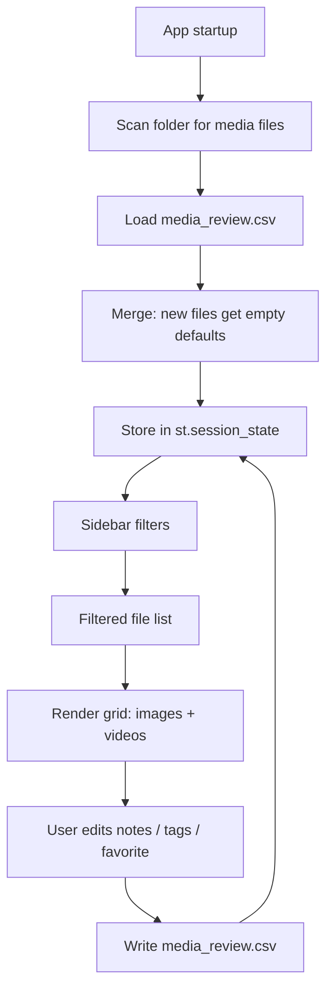

# House Media Review App

## File to Create
- `app.py` — single self-contained Streamlit app
- `media_review.csv` — auto-created on first run, never uploaded

## Dependencies (install via pip)
```
streamlit
pillow
pillow-heif   # HEIC support (graceful fallback if unavailable)
pandas
watchdog      # future: auto-refresh when new files appear
```

## App Structure

### Data Layer
- Scan `Path(".")` recursively for all supported extensions **once**, stored in `st.session_state` — not re-run on every widget interaction
- A manual **Refresh** button in the sidebar triggers a rescan and clears the cached result
- Skip hidden/system folders during scan: `.git`, `node_modules`, `__pycache__`, `.venv`, `venv`
- Use `pathlib.Path` everywhere — no `os.path`
- Load/save `media_review.csv` with columns: `filepath, notes, tags, favorite` — CSV stays as CSV, no SQLite
- Merge scan results with CSV data on load; new files get empty defaults

### Layout
- **Sidebar**: filters — file type (images / videos / all), tag (multi-select from known tags), favorites only toggle; plus a "Columns" slider (2–5)
- **Main area**: filtered results shown in a responsive `st.columns()` grid

### Per-file Card (images)
- Thumbnails are generated at ~400px width using Pillow and cached with `@st.cache_data(hash_funcs=...)` keyed on path + mtime — full-resolution images are never loaded unless explicitly opened
- Thumbnail cache is stored in memory only (no disk cache file needed at this scale)
- HEIC loaded via `pillow_heif.register_heif_opener()` if available, else shown as a placeholder — no crash
- Filename + relative path shown below thumbnail
- `st.text_area` for notes (auto-saves on change)
- `st.text_input` for tags (comma-separated, e.g. `kitchen, bathroom`)
- `st.checkbox` for favorite

### Per-file Card (videos)
- **mp4 only for now** — `st.video()` with mp4 works reliably; mov/avi deferred to avoid codec issues
- Same notes/tags/favorite controls below

### Persistence
- All edits immediately call a `save_csv()` function that writes the full dataframe back to `media_review.csv`
- Session state holds in-memory edits; CSV is the single source of truth on reload

## Data flow



## Key decisions
- **No uploads** — `st.image()` and `st.video()` serve files directly from disk, fully local
- **Memory-safe** — only thumbnail-sized images (400px) are loaded into memory; full-res stays on disk
- **Thumbnails cached** — `@st.cache_data` keyed on path + file mtime; regenerated only when files change
- **pathlib everywhere** — no `os.path` usage anywhere in the codebase
- **CSV stays CSV** — no migration to SQLite; `media_review.csv` is human-readable and inspectable
- **Tags** are free-text comma-separated strings; sidebar multi-select built dynamically from all known tags
- **mp4 first** — mov/avi support is intentionally deferred; `st.video()` handles mp4 reliably across browsers
- **HEIC** supported if `pillow-heif` is installed, otherwise graceful placeholder — no crash
- **watchdog** is a listed dependency for future auto-refresh, not wired up in v1
- **No lazy pagination yet** — deferred until the grid becomes slow at scale (10GB+)
