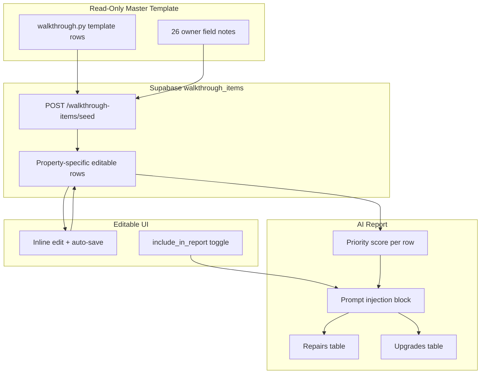

# Interior Walkthrough + Print Deep Detail Plan

## Architecture (updated)

Use **two layers** with seller-friendly naming:

| Layer | Name | Purpose |
|-------|------|---------|
| **Layer 1** | Room-by-Room Seller Assessment | What buyers see in photos and showings |
| **Layer 2** | Hidden Issues & Transaction Risk | What inspectors, appraisers, and lenders flag |

> Renamed from "Inspection Risk" — sellers don't think in inspection terms. "Hidden Issues & Transaction Risk" is immediately understandable.

Classify every item into **three seller-facing buckets** (AI output, not a fourth checklist):

- **Fix Before Listing** — safety, functional failure, disclosure, financing blockers
- **Consider Upgrading** — cosmetic/ROI items that move sale price
- **Leave Alone** — functional but dated; cost exceeds return

### Core principle: treat every item as a scoring object

Even when fields are empty initially, each row is shaped as:

```
component → condition → visibility → risk → cost → roi → action
```

This is what makes recommendations feel intelligent instead of checklist-driven.



---

## Data model

### Supabase table (new)

Run in Supabase SQL editor. Use existing property ID convention: `130_kingfisher` (matches [`INVENTORY_OVERRIDE_ID`](C:\Users\kirel\simpsonville-analyzer\main.py)).

```sql
create table walkthrough_items (
  id uuid primary key default gen_random_uuid(),
  property_id text not null,
  zone text not null,
  component text not null,
  layer text not null,              -- 'room' | 'systems'
  category text,                    -- cosmetic | functional | dated | inspection_risk
  condition_score integer,          -- 1-5, null = not assessed
  action text,                      -- assess | fix | upgrade | skip
  owner_note text,
  buyer_visibility text,            -- high | medium | low
  inspection_risk text,             -- high | medium | low
  estimated_cost_low integer,
  estimated_cost_high integer,
  priority_score integer,           -- computed; nullable until scored
  sort_order integer default 0,     -- stable display order within zone groups
  include_in_report boolean default true,
  source text default 'template',   -- template | owner | photo | user
  created_at timestamptz default now(),
  updated_at timestamptz default now()
);

create index walkthrough_items_property_idx on walkthrough_items (property_id);

create unique index walkthrough_items_unique_seed
  on walkthrough_items (property_id, zone, component, layer);
```

### Categories (four, not three)

| Category | Meaning | Example |
|----------|---------|---------|
| `cosmetic` | Visual/marketability | Scuffed baseboards, mixed door knob finishes |
| `functional` | Works or doesn't | Garbage disposal, fireplace ignition |
| `dated` | Works but looks old | 20-year dishwasher, builder-grade vanity light |
| `inspection_risk` | Deal/concession risk | Roof age, water intrusion, missing GFCI |

The `dated` category is critical — not broken, not risky, just old. Huge seller decision category.

### buyer_visibility (add now)

Scale: `high` | `medium` | `low`

| Item | Visibility |
|------|------------|
| Countertops | High |
| Fireplace | High |
| Vanity mirror | High |
| Interior light fixtures | High |
| Roof | Low |
| Water heater | Low |
| GFCI outlet | Low |

Stored on every row. Empty initially for template-only rows; pre-filled on owner-noted rows where obvious.

### Full row shape (Python / API)

```python
{
  "id": "uuid",
  "property_id": "130_kingfisher",
  "zone": "kitchen",
  "component": "Countertops",
  "layer": "room",                    # room | systems
  "category": "dated",                # cosmetic | functional | dated | inspection_risk
  "condition_score": 2,               # 1-5 or null
  "action": "upgrade",                # assess | fix | upgrade | skip
  "owner_note": "Dated laminate",
  "buyer_visibility": "high",
  "inspection_risk": "low",
  "estimated_cost_low": 1800,
  "estimated_cost_high": 4000,
  "priority_score": null,             # computed later
  "include_in_report": true,
  "source": "owner"                   # template | owner | photo | user
}
```

### Editable fields in UI

| Field | Editable? |
|-------|-----------|
| Zone | yes |
| Component | yes |
| Category | yes (dropdown) |
| Condition (1–5) | yes (dropdown) |
| Action | yes (dropdown) |
| Owner note | yes (text) |
| Buyer visibility | yes (dropdown) |
| Inspection risk | yes (dropdown) |
| Cost low / high | yes (number, optional) |
| Priority | yes (number, optional override) |
| Include in report | yes (toggle) |

**Do not** make the master template editable. Only property-specific rows in `walkthrough_items` are editable. Template stays clean in [`walkthrough.py`](C:\Users\kirel\simpsonville-analyzer\walkthrough.py).

---

## Read-only master template

Create [`walkthrough.py`](C:\Users\kirel\simpsonville-analyzer\walkthrough.py):

- `WALKTHROUGH_TEMPLATE` — all Layer 1 + Layer 2 rows with default `category`, `buyer_visibility`, `inspection_risk`
- `OWNER_NOTE_SEEDS` — your 26 field notes mapped to matching template rows (sets `action: assess`, `owner_note`, `source: owner`)
- `seed_walkthrough_items(property_id)` — inserts template + owner overrides if table is empty
- `build_walkthrough_prompt_block(rows)` — formats `include_in_report=true` rows for Gemini
- `compute_priority_score(row)` — stub for Phase 2; returns null in Phase 1

### Layer 1 zones (Room-by-Room Seller Assessment)

- **Entry/Foyer** — front door, lockset, flooring, baseboards, walls/paint, light fixture, smoke detector
- **Great Room** — flooring, paint, ceiling, windows, blinds, fixtures, ceiling fan, fireplace, built-ins, outlets
- **Kitchen** — cabinets, countertops, sink/faucet/disposal/leaks, appliances, backsplash, lighting, GFCI, pantry
- **Dining Room** — flooring, walls, fixture, windows, baseboards
- **Bedrooms** (primary, bed 2, bed 3) — flooring, paint, baseboards, windows, closet, fan, fixture, outlets, hardware
- **Bathrooms** (primary + full) — vanity, shower/tub, toilet, exhaust, lighting, GFCI, hardware
- **Laundry** — hookups, dryer vent, utility sink, flooring, shelving, lighting
- **Hallways** — paint, flooring, baseboards, smoke detectors, fixtures, linen closet
- **Sun Room** — outlets, switches, ceiling fan/fixture, doors (from your notes)
- **Interior Doors** — operation, latch, hinges, hardware, paint
- **Windows** — operation, locks, screens, seals, trim
- **Garage Interior** — door, floor, walls

### Layer 2 zones (Hidden Issues & Transaction Risk)

- **Exterior** — roof, gutters/downspouts/drainage, siding, trim/rot, caulk, paint, driveway, walkway, deck, porch, fence, landscaping
- **Structural/Moisture** — foundation, water intrusion, ceiling stains, vaulted seam, crawlspace access
- **HVAC** — age, service, filter, condensate, thermostat
- **Electrical** — GFCI/AFCI, panel, cover plates, smoke/CO detectors
- **Plumbing** — leaks, pressure, drains, water heater, faucets

### Owner notes → seed overrides

| Your note | Zone | Component | Default visibility |
|-----------|------|-----------|-------------------|
| 2 gal trim paint | whole house | Trim paint | medium |
| Sun room counts | sun room | Electrical / fixtures | medium |
| 3 exterior doors + assess all | doors | Door assessment | high |
| Kitchen countertops? | kitchen | Countertops | high |
| Pressure wash | exterior | Pressure wash | high |
| Exterior lighting | exterior | Exterior lighting | high |
| Front porch | exterior | Front porch | high |
| Landscaping/yard | exterior | Landscaping | medium |
| Popcorn ceiling | whole house | Popcorn ceiling | medium |
| Paint interior walls and trim | whole house | Interior paint | high |
| Water damaged ceilings | whole house | Ceiling water damage | medium |
| Vaulted ceiling seam | great room | Ceiling seam | low |
| Fireplace | great room | Fireplace | high |
| Master bath vanity/mirror | primary bathroom | Vanity / mirror | high |
| Master closet repaint | primary bedroom | Closet paint | medium |
| Master bath modernization | primary bathroom | Bath modernization | high |
| Kitchen cabinets | kitchen | Cabinets | high |
| Kitchen sink | kitchen | Sink | medium |
| Appliance assessment | kitchen | Appliances | high |
| Floor eval | whole house | Flooring | high |
| Interior light fixtures | whole house | Interior lighting | high |
| Garage door/floor/walls | garage | Garage interior | medium |
| Driveway cracks | exterior | Driveway | medium |
| Faucets | whole house | Faucets | medium |
| Roof drainage | exterior | Gutters / drainage | low |

---

## API endpoints

Add to [`main.py`](C:\Users\kirel\simpsonville-analyzer\main.py):

```python
GET  /walkthrough-items              # list rows for property (default 130_kingfisher)
POST /walkthrough-items              # create new row (user-added)
PATCH /walkthrough-items/{id}        # update any editable field; set updated_at
DELETE /walkthrough-items/{id}        # remove row
POST /walkthrough-items/seed         # seed from template + owner notes if empty
```

### Flow

1. **First load:** `POST /walkthrough-items/seed` — idempotent; skips if rows already exist for property
2. **UI loads:** `GET /walkthrough-items` — renders editable checklist
3. **User edits:** `PATCH` on change (debounced ~500ms, same pattern as inventory overrides)
4. **Report generation:** `generate_roi_report()` loads rows where `include_in_report = true` and passes to prompt builder
5. **Regenerate:** uses latest saved walkthrough state, not stale template

---

## AI integration ([`roi.py`](C:\Users\kirel\simpsonville-analyzer\roi.py))

### Prompt injection

Replace static `_OWNER_WALKTHROUGH_BLOCK` with dynamic block built from saved Supabase rows:

- Only rows with `include_in_report = true`
- Sort by `priority_score` desc (when present), else by `buyer_visibility` (high first) for upgrades and `inspection_risk` (high first) for repairs
- Include: zone, component, category, condition_score, action, owner_note, cost range, visibility, risk

### Prompt rules

- `action: fix` → must appear in repairs (consolidate related: water damage + vaulted seam → one ceiling repair)
- `action: upgrade` → must appear in upgrades (consolidate: interior paint + master closet + trim → one paint upgrade)
- `action: assess` → scoped as "evaluate and quote" with cost anchors
- `category: dated` + `action: skip` → explicitly tell AI to **not** recommend unless condition ≤ 2
- Add missing cost anchors: driveway crack repair, roof drainage, fireplace service, exterior lighting, appliance assessment, crawlspace door

### Raise Deep Dive caps

Bump `deep_dive` from 8+8 to **12+12** in [`_RECOMMENDATION_LIMITS`](C:\Users\kirel\simpsonville-analyzer\roi.py).

---

## Priority Score (Phase 2 — design now, implement later)

**Seller Walkthrough Score** — for AI prioritization, not consumer UI initially.

```
Priority Score = f(condition, buyer_visibility, inspection_risk, roi, cost)

Example:
  Vanity light:  condition=2, visibility=high, risk=low, roi=high  → 87
  HVAC:          condition=3, visibility=low,  risk=high, roi=low  → 41

→ AI replaces vanity light before touching HVAC.
```

Phase 1: `compute_priority_score()` returns `null`; prompt sorts by visibility/risk fields directly.

Phase 2: weighted formula stored on row; auto-recalculates on PATCH when condition/visibility/risk/cost change.

---

## UI — Editable Walkthrough section

Add `#section-walkthrough` in [`static/index.html`](C:\Users\kirel\simpsonville-analyzer\static\index.html) between Dated Features and Recommended Upgrades.

### Table columns (inline editable)

| Zone | Component | Category | Condition | Action | Visibility | Note | Cost | Include |
|------|-----------|----------|-----------|--------|------------|------|------|---------|
| Kitchen | Countertops | dated ▾ | 2/5 ▾ | Upgrade ▾ | High ▾ | Dated laminate | $1.8–4k | ✓ |

- Dropdowns for: Category, Condition (1–5 or blank), Action, Buyer visibility, Inspection risk
- Text input for Owner note
- Optional cost low/high (collapsed by default, expand on click)
- Toggle for Include in report
- **Add row** button per zone (POST new item)
- **Delete** on row hover (with confirm)
- Grouped by layer, then zone — collapsible `<details class="report-collapse">`
- Unsaved indicator + save status (match inventory tab pattern)
- Included in print

### Wire-up

- On report tab load: seed (if needed) → fetch items → `renderWalkthrough(items)`
- Sidebar nav: "Walkthrough"
- Changing `include_in_report` or `action` shows hint: "Regenerate report to apply changes"

---

## Inventory updates ([`run_roi.py`](C:\Users\kirel\simpsonville-analyzer\run_roi.py))

- Add **"sun room"** to `_CANONICAL_ROOMS` with counts: `{outlets: 7, switch_plates: 2, ceiling_fans: 1, light_fixtures: 1, doors: 2, sqft: 200}`
- Aliases: `"sunroom"`, `"sun room"` → `"sun room"`
- **Trim Paint** card in inventory UI: fixed **2 gallons** (owner note; separate from wall paint sqft ÷ 175)

---

## Print with all Deep Detail expanded

Current print CSS hides deep detail panels (line ~1099 in `index.html`). Fix:

1. Make `printReport()` **async** — button shows "Preparing print…"
2. Before `window.print()`:
   - Expand all collapsibles and table detail rows
   - `Promise.all` prefetch deep detail for every upgrade/repair item
   - Render all panels `display: block`
3. Update `@media print`: show `.deep-detail-panel`, hide buttons/spinners
4. Use `printPrepMode` flag instead of blocking in `fetchDeepDetail`
5. `page-break-inside: avoid` on `.deep-detail-section`

First print: 10–30s if details uncached. Subsequent prints: fast via `deepCache` + Supabase.

---

## Files to create/modify

| File | Change |
|------|--------|
| **NEW** `migrations/walkthrough_items.sql` | Supabase table DDL |
| **NEW** [`walkthrough.py`](C:\Users\kirel\simpsonville-analyzer\walkthrough.py) | Template, seeds, seed function, prompt builder, priority stub |
| [`main.py`](C:\Users\kirel\simpsonville-analyzer\main.py) | CRUD + seed endpoints; load walkthrough rows in report generation |
| [`roi.py`](C:\Users\kirel\simpsonville-analyzer\roi.py) | Dynamic walkthrough prompt block; cost anchors; bump deep_dive limits |
| [`run_roi.py`](C:\Users\kirel\simpsonville-analyzer\run_roi.py) | Sun room canonical room + aliases |
| [`static/index.html`](C:\Users\kirel\simpsonville-analyzer\static\index.html) | Editable walkthrough section, trim paint card, async print |

---

## Test plan

1. `POST /walkthrough-items/seed` → ~80 template rows + 26 owner overrides in Supabase
2. Walkthrough UI → edit condition/action/note on kitchen countertops → PATCH saves → reload persists
3. Toggle `include_in_report` off on an item → regenerate → item absent from AI prompt
4. Regenerate Deep Dive → interior items appear (popcorn, paint, master bath, kitchen) alongside exterior
5. Inventory → sun room row + 2 gal trim paint card
6. Print → all sections + all deep detail panels visible in print preview
7. Phase 2 smoke: set condition=2, visibility=high on vanity light → verify sort order in prompt block

---

## What moved from Phase 2 → Phase 1

Per your feedback, these are now **in scope**:

- Persisted `walkthrough_items` Supabase table
- Editable inline checklist UI with auto-save
- `buyer_visibility` field on every row
- `dated` category
- `include_in_report` toggle controlling AI injection
- Full row shape (condition, visibility, risk, cost, action) even when empty

## What stays Phase 2

- `compute_priority_score()` weighted formula + auto-sort
- Auto-fill condition from photo `issues_by_room` / `dated_features`
- Link checklist rows to specific upgrade/repair table items (click-through)
- Consumer-facing priority score display
