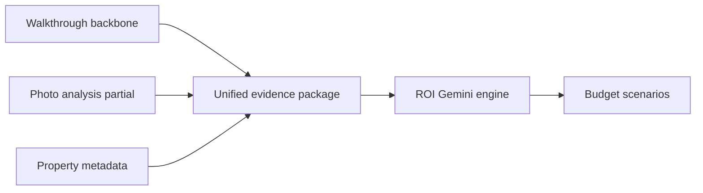
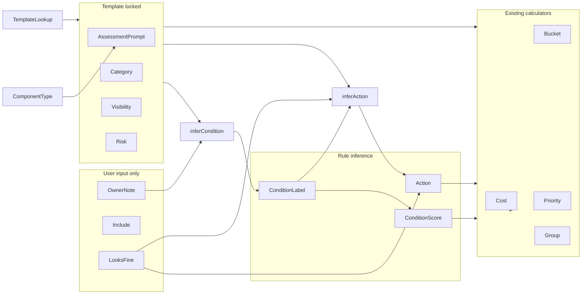

# Walkthrough Phase 1: Maximum Automation

## Goal

Replace inconsistent 1–5 condition scoring and manual visibility/risk/category picks with a **template + inference** pipeline. The homeowner walks the house and only touches the ~20–30 items that matter; everything else is handled by pre-filled prompts and one-click dismissal.

**Walkthrough editable fields:** Note, Looks Fine (and Include — feeds ROI)  
**Walkthrough visible output:** Evidence only — zone, component, note. **No recommendations, no prioritization, no buckets in the UI.**

**Internal fields (backend only, Advanced toggle):** Condition, action, cost, priority, bucket — computed to help the ROI engine, never shown to the seller by default.

**Product split — eliminate overlap:**

| Layer | Tab | Answers | Example output |
|-------|-----|---------|----------------|
| **Evidence** | Walkthrough | *What's true about my house?* | Countertops: Original laminate from 1999 |
| **Decision** | ROI | *I have $5k — what should I spend it on?* | Budget scenario with prioritized projects |



**Coverage model:**

| Source | Coverage | Role |
|--------|----------|------|
| Walkthrough template | 100% of ~130 components | Backbone — every component exists even if empty |
| Photo analysis | Partial (rooms photographed) | Supplemental — fills gaps where seller didn't note |
| Property metadata | 100% of property | Gap-filler — low-confidence inference only |

Photos are **not** required and **not** primary. Walkthrough provides corrections; photos strengthen confidence where available.

**Workflow:**

```text
Walk room → type observations → mark rest looks fine
                                        ↓
                              ROI tab → pick budget scenario
                                        ↓
                              Regenerate → print decision plan
```

The seller's real question is not *"What's wrong?"* but *"I have $5k — what should I spend it on?"* (or $15k, or nothing, or maximize regardless of budget). **The ROI tab answers that.**

**Data-entry model:**

| Row state | What user sees | What gets inferred |
|-----------|----------------|-------------------|
| Default (untouched) | Assessment prompt as placeholder; Note empty | Nothing shown to user; backend: unknown |
| User observation | Note replaced with real text | **UI shows note only**; backend infers condition/action for ROI |
| Looks Fine | Note empty; row dimmed | **UI shows checkmark only**; `looks_fine=true`; excluded from ROI evidence |

**Key semantic:** `looks_fine` means *"seller has no concerns"* — not *"item is objectively good."* A water heater marked Looks Fine is dismissed, not certified new. Store `looks_fine` and `condition_label` independently.

You chose **rule-based note inference** for Phase 1 (Gemini deferred to Phase 3).

---

## Current state (what we leverage)

The template in [`walkthrough.py`](C:\Users\kirel\simpsonville-analyzer\walkthrough.py) already bakes in category, visibility, and risk per component:

```117:123:C:\Users\kirel\simpsonville-analyzer\walkthrough.py
def _room_zone(zone: str, components: list[tuple], base_order: int, layer: str = "room") -> list[dict]:
    ...
        name, cat, vis, risk = comp[:4]
        rows.append(_item(zone, name, layer, category=cat, buyer_visibility=vis,
                          inspection_risk=risk, sort_order=base_order + offset))
```

The UI in [`static/index.html`](C:\Users\kirel\simpsonville-analyzer\static\index.html) still exposes ~12 editable columns (zone, component, category, condition 1–5, visibility, risk, cost, priority). That is the main change surface.

---

## Architecture (Phase 1)



**Two note fields — do not conflate:**

| Field | Stored? | Purpose | Sent to ROI prompt? |
|-------|---------|---------|---------------------|
| `assessment_prompt` | No (computed at enrich) | Walk-the-house guidance shown as placeholder | Never |
| `owner_note` | Yes (DB) | Real seller observation | Only when non-empty |

**Enrichment order** (in `enrich_walkthrough_item`):

1. Attach `assessment_prompt` via `get_assessment_prompt(component, category)` — not persisted
2. `apply_template_defaults(row)` — set category / `buyer_visibility` / `inspection_risk` from template unless override flags set
3. `resolve_condition(row)` — **never** set condition from `looks_fine`; infer from `owner_note` only (unless `condition_overridden`); default unknown
4. `resolve_action(row)` — infer action from condition + category + risk + note (unless `action_overridden` or `looks_fine`)
5. Attach `condition_display` — `"assumed_good"` when `looks_fine=true` and `condition_label=unknown`; else equals `condition_label` (enrich-only, not persisted)
6. Existing `calculate_walkthrough_fields(row)` — priority uses inferred action; condition score only when observation exists

---

## 1. Schema: migration v3

New file: [`migrations/walkthrough_items_v3.sql`](C:\Users\kirel\simpsonville-analyzer\migrations\walkthrough_items_v3.sql)

| Column | Purpose |
|--------|---------|
| `condition_label` text | `unknown`, `good`, `fair`, `poor`, `replace` |
| `condition_overridden` boolean | User set condition in Advanced |
| `category_overridden` boolean | User set category in Advanced |
| `visibility_overridden` boolean | User set visibility in Advanced |
| `risk_overridden` boolean | User set risk in Advanced |
| `looks_fine` boolean | Seller has no concerns — independent of `condition_label` |
| `action_overridden` boolean | User set action in Advanced |
| `observations` jsonb | Empty in Phase 1; schema hook for Phase 2 checkboxes |

**Keep `condition_score` integer** as the internal scoring input (priority formula already uses it). Do not ask users for 1–5 anymore.

**Do not add `assessment_prompt` column** — computed from component type at enrich time so prompt library updates apply on Recalculate without re-seeding.

**Backfill on migration:**

```sql
-- Map legacy scores to labels (approximate)
-- 5→good, 4→good, 3→fair, 2→poor, 1→replace
```

Also append `condition_label` + override columns to [`migrations/walkthrough_items.sql`](C:\Users\kirel\simpsonville-analyzer\migrations\walkthrough_items.sql) for fresh installs.

---

## 2. Backend: assessment prompts + template lookup + condition inference

### 2a. Assessment prompt library

Add `ASSESSMENT_PROMPTS: dict[str, str]` in [`walkthrough.py`](C:\Users\kirel\simpsonville-analyzer\walkthrough.py), keyed by normalized component name, with category fallbacks (`dated`, `functional`, `inspection_risk`, `cosmetic`).

Examples (component-specific overrides category default):

| Component | Prompt |
|-----------|--------|
| Countertops | Condition unknown. Assess age, material, staining, chips, cracks, and overall marketability. |
| Fireplace | Confirm ignition, operation, and service history. |
| Dryer vent | Confirm venting, airflow, and cleaning status. |
| Flooring | Check wear patterns, damage, and whether replacement is market-expected. |
| Water heater age | Confirm age, service history, and remaining useful life. |

`get_assessment_prompt(component, category)` returns the best match; generic fallback: `"Assess condition and note anything a buyer or inspector would flag."`

**Refactor `OWNER_NOTE_SEEDS`:** Move generic "Assess…" strings out of `owner_note` into `ASSESSMENT_PROMPTS`. Keep only **property-specific facts** in seeds, e.g.:

- Keep: `"Garage door has confirmed structural crack"`, `"7 outlets observed"`, `"2 gallons trim paint needed"`
- Remove from seeds (becomes prompt only): `"Assess fireplace — ignites? remote?"`, `"Assess for replacement — dated laminate?"`

After refactor, ~26 seed rows shrink to ~10–15 rows with real Kingfisher-specific observations; the rest start with empty `owner_note` + assessment prompt placeholder.

### 2b. Template index

In [`walkthrough.py`](C:\Users\kirel\simpsonville-analyzer\walkthrough.py), build `TEMPLATE_DEFAULTS: dict[tuple[str,str,str], dict]` from `WALKTHROUGH_TEMPLATE` at module load:

```python
key = (zone.lower(), component.lower(), layer)  # → {category, buyer_visibility, inspection_risk}
```

Expose `get_template_defaults(zone, component, layer)`.

### 2c. Condition label mapping

```python
CONDITION_LABEL_TO_SCORE = {
    "unknown": None,  # no condition weight in priority
    "good": 4,
    "fair": 3,
    "poor": 2,
    "replace": 1,
}
```

### 2d. Rule-based `infer_condition_from_owner_note()`

**Only runs on `owner_note`** — never on `assessment_prompt`. Empty `owner_note` → condition = unknown (not fair/poor by category alone).

**Condition semantics (do not conflate dated with damaged):**

| Label | Meaning | Example notes |
|-------|---------|---------------|
| **Fair** | Noticeably worn, dated, or aging — still functional | `Original laminate from 1999`, `builder grade`, `popcorn ceiling` |
| **Poor** | Defective, damaged, or impaired — needs attention | `water stain`, `cracked`, `leak`, `not working` |
| **Replace** | Clearly at end of useful life | `full replacement needed`, `condemned` |

Old and ugly ≠ poor. **Age, material, and dated appearance keywords alone must infer Fair, never Poor.** Poor requires an explicit defect signal (damage, stain, leak, failure, mold, etc.). If both appear (`original laminate, cracked`), defect wins → poor.

Canonical example: `"Original laminate from 1999"` → **Fair** (not Poor) → action **upgrade**.

| Priority | Source | Label |
|----------|--------|-------|
| 1 | `condition_overridden` | user-set label |
| 2 | `owner_note` keyword match | see table below |
| 3 | default | unknown |

`looks_fine` does **not** set `condition_label`. UI shows **Assumed Good** via `condition_display` only.

Keyword tiers (case-insensitive, `owner_note` only):

| Tier | Signals | Label |
|------|---------|-------|
| Defect | `damaged`, `cracked`, `stain`, `leak`, `broken`, `not working`, `doesn't`, `water damage`, `mold`, `failing` | poor |
| Aging only | `dated`, `worn`, `original`, `builder grade`, `laminate`, `popcorn`, `1990`, `1999`, `2000`, `aging`, `ugly`, `old` | fair |
| End of life | `replace`, `end of life`, `full replacement`, `condemned` | replace |
| Positive | `recently updated`, `new`, `replaced`, `good condition`, `works normally`, `looks fine` | good |
| Untested | `hasn't been used`, `untested`, `unknown if works` | fair (not poor — lack of use is not a defect) |

**Precedence:** replace > poor (defect tier only) > fair > good. Aging-tier keywords never promote to poor without a defect-tier match in the same note.

Wire into `resolve_condition(row)` and persist both `condition_label` and `condition_score` in `apply_calculated_persist_fields()`.

### 2e. Rule-based `infer_action()`

**Default UI removes Action dropdown.** Infer unless `action_overridden` or user PATCH in Advanced.

| Situation | Action |
|-----------|--------|
| `looks_fine=true` | skip |
| `condition_label=unknown` (no note) | assess |
| `condition_label` in poor/replace + damage keywords in note (stain, leak, crack, mold, water) | fix |
| `condition_label` in poor/replace + `inspection_risk=high` | fix |
| `condition_label` in fair/poor/replace + `category` in dated/cosmetic | upgrade |
| `condition_label=good` (explicit observation) | skip |
| `condition_label` in fair/poor + `category=functional` + `inspection_risk` medium/high | fix |
| otherwise | assess |

Examples matching user intent:

- `"Water stain near hallway"` → condition poor → **fix**
- `"Original laminate from 1999"` → condition fair → **upgrade**
- `"Garage door structural crack"` → condition poor + high risk → **fix**

Persist inferred `action` in `apply_calculated_persist_fields()` unless `action_overridden`.

### 2f. "Looks Fine" shortcut

New endpoint: `POST /walkthrough-items/{id}/looks-fine`

Sets atomically:

```python
{
  "looks_fine": True,
  # condition_label and condition_score UNCHANGED (stay unknown / null)
  "include_in_report": False,
  "owner_note": None,
}
```

Then `resolve_action()` → skip, recalc cost/priority/bucket. UI: row dimmed, badge **Assumed Good**, action badge **Skip**.

Undo: typing a note clears `looks_fine`; or explicit undo button sets `looks_fine=false`.

### 2g. Zone bulk: "Mark Remaining Items in Room as Looks Fine"

**Phase 1 requirement** (not stretch).

New endpoint: `POST /walkthrough-items/zone-looks-fine`

```json
{ "zone": "kitchen", "property_id": "130_kingfisher" }
```

Applies looks-fine logic to rows in that zone where **all** of:

- `owner_note` is empty
- `looks_fine` is false
- `condition_overridden` is false

Skips rows the user already noted (e.g. countertops, cabinets). Returns `{ "marked": N, "skipped": M }`.

UI: zone section header button — **"Mark remaining in [Zone] as looks fine"**.

### 2h. Template lock on recalculate

Extend `recalculate_all_items()` and every PATCH/create path:

- If not `*_overridden`, overwrite category/visibility/risk from template
- Always re-run condition inference unless `condition_overridden`
- Always re-run action inference unless `action_overridden`
- Then run existing cost/priority/bucket calculators

### 2i. Evidence for ROI → see §3 Unified evidence package

`build_walkthrough_prompt_block()` is superseded by `build_evidence_package()` + `format_evidence_prompt()` in new [`evidence.py`](C:\Users\kirel\simpsonville-analyzer\evidence.py). Walkthrough contributes `walkthrough_evidence`; photos and property facts are merged with explicit precedence.

---

## 3. Unified evidence package (architecture)

This is the **biggest unanswered question** resolved: how three sources combine before ROI.

### 3a. Single evidence package

New module [`evidence.py`](C:\Users\kirel\simpsonville-analyzer\evidence.py):

```python
def build_evidence_package(
    walkthrough_rows: list[dict],
    photo_summary: dict,          # from build_analysis_summary() in run_roi.py
    property_facts: dict,         # specs, year built, sqft, market value
) -> dict:
    return {
        "property_facts": property_facts,
        "components": [            # one entry per walkthrough template row
            {
                "zone": "kitchen",
                "component": "Countertops",
                "layer": "room",
                "walkthrough_note": "Original laminate from 1999",  # or None
                "looks_fine": False,
                "photo_observations": ["Laminate counters visible"],  # matched from photo_summary
                "property_context": ["House built 1999"],             # when relevant
                "confidence_tier": "confirmed",  # confirmed | observed | inferred | unknown
                "template_category": "dated",
                "template_risk": "low",
            },
            ...
        ],
        "photo_only_findings": [...],   # issues in photos with no walkthrough component match
        "walkthrough_only_findings": [...],  # notes with no photo corroboration
    }
```

**Per-component merge** — walkthrough template row is the join key (~130 components). Photo findings from `issues_by_room`, `upgrades_by_room`, `dated_features_by_frequency` are matched to components via zone alias map + keyword overlap (e.g. `countertop` → Countertops, `vanity` → Vanity mirror).

`looks_fine=true` rows: included in package as dismissed (no note, excluded from ROI recommendations) but listed so Gemini knows seller has no concerns.

### 3b. Evidence hierarchy (precedence on conflict)

| Priority | Source | Rule |
|----------|--------|------|
| 1 | **Walkthrough** | Seller observation wins on conflict |
| 2 | **Photos** | Fill gaps where walkthrough is silent |
| 3 | **Property metadata** | Fill remaining gaps with low-confidence inference |

**Examples:**

| Conflict | Resolution |
|----------|------------|
| Photo: "granite countertops" / Walkthrough: "laminate" | Use walkthrough — **laminate** |
| Walkthrough: silent / Photo: "builder-grade oak vanity" | Use photo observation |
| No photo, no note / Metadata: built 1999 | Infer *"finishes may be original"* — tier **inferred**, confidence low |

### 3c. Confidence tiers

Classify every finding before ROI scenarios rank recommendations:

| Tier | Definition | Example | ROI weight |
|------|------------|---------|------------|
| **confirmed** | Multiple sources agree | Walkthrough "laminate 1999" + photo "laminate counters" | Highest — prioritize in all scenarios |
| **observed** | One direct source | Walkthrough only: "water stain in hallway" | Medium-high — prioritize in $5k+ |
| **inferred** | Metadata/context only | "Many finishes likely original to 1999" | Low — **Maximize** only; never drive Spend Nothing |
| **unknown** | No evidence | Water heater: no note, no photo | Do not recommend replacement based on age alone |

Prevents AI from recommending a $7,000 countertop replacement solely because the house was built in 1999.

**Tier assignment logic:**

```python
if walkthrough_note and photo_observations and _agree(note, photos):
    tier = "confirmed"
elif walkthrough_note or photo_observations:
    tier = "observed"
elif property_context and not looks_fine:
    tier = "inferred"
else:
    tier = "unknown"
```

### 3d. Per-component examples

| Component | Walkthrough | Photo | Metadata | Result |
|-----------|-------------|-------|----------|--------|
| Countertops | Original laminate from 1999 | Laminate visible | built 1999 | **confirmed** — dated laminate |
| Water heater | (none) | (none) | built 1999 | **unknown** — do not assume end-of-life |
| Fireplace | Untested | Gas fireplace visible | — | **observed** — condition unknown, exists |
| Bathroom vanity | (none) | Builder-grade vanity | — | **observed** — photo fills gap |
| Dryer vent | (none) | (none) | — | **unknown** — prompt exists, no evidence |

### 3e. Prompt format for Gemini

`format_evidence_prompt(package, scenario)` renders:

```text
EVIDENCE SOURCES (read in this order)
--------------------------------------
1. Walkthrough observations — HIGHEST confidence; seller ground truth
2. Photo analysis findings — MEDIUM confidence; supplemental where walkthrough is silent
3. Property metadata — LOWEST confidence; gap-filler only

If sources conflict, prefer walkthrough observations.

CONFIRMED FINDINGS (multiple sources agree)
--------------------------------------------
- [Kitchen] Countertops: dated laminate (walkthrough + photo)

OBSERVED FINDINGS (single direct source)
-----------------------------------------
- [Whole house] Ceiling: "Water stain in hallway" (walkthrough)
- [Primary bathroom] Vanity: builder-grade cultured marble (photo)

INFERRED FINDINGS (metadata only — low confidence)
--------------------------------------------------
- Many interior finishes may be original to 1999 construction

DISMISSED BY SELLER (looks_fine — do not recommend)
----------------------------------------------------
- [Kitchen] Appliances (overall)
- [Laundry] Dryer vent
...

PROPERTY FACTS
--------------
Built 1999 | 2,019 sqft | 3 bed / 2 bath | Simpsonville SC
```

No recommendation language. No buckets. Evidence + confidence tiers only.

### 3f. How budget scenarios weight evidence

| Scenario | Primary drivers | Tier preference |
|----------|-----------------|-----------------|
| **Spend Nothing** | Walkthrough observed findings (transaction-risk) | confirmed + observed walkthrough issues only; ignore inferred |
| **$5k Budget** | Walkthrough + photos (cosmetic ROI) | confirmed first, then observed; inferred only if budget remains |
| **$15k Budget** | Walkthrough + photos (balanced) | confirmed → observed → selective inferred |
| **Maximize Sale Price** | Photos + walkthrough + metadata | all tiers; inferred opportunities OK with low-confidence label |

Add to each `_budget_scenario_block()` in [`roi.py`](C:\Users\kirel\simpsonville-analyzer\roi.py):

```text
Prioritize recommendations: Confirmed > Observed > Inferred.
Do not recommend upgrades based solely on Inferred findings.
Spend Nothing must not include Inferred-tier items.
```

### 3g. Wiring in main.py

Replace `_walkthrough_prompt_block(sb)` with:

```python
def _evidence_prompt_block(sb, scenario: str) -> str:
    rows = load_walkthrough_items(sb, PROPERTY_ID)
    summary = build_analysis_summary(_load_photo_analyses(sb))
    facts = _property_facts()  # from existing _PROPERTY_CONTEXT fields
    package = build_evidence_package(rows, summary, facts)
    return format_evidence_prompt(package, scenario)
```

Pass to `roi.py` generate calls instead of `walkthrough_block`.

---

## 4. API: narrow default PATCH surface

In [`main.py`](C:\Users\kirel\simpsonville-analyzer\main.py):

**`WalkthroughItemPatch`** — add `condition_label`, `observations`; keep advanced fields for override path.

**PATCH behavior:**

| Field patched | Side effect |
|---------------|-------------|
| `include_in_report` | Recalc computed fields |
| `owner_note` | Clear `looks_fine` if set; re-infer condition + action (unless overridden), recalc |
| `looks_fine` (via shortcut / zone bulk) | Set flag only; infer action=skip; exclude from report; condition stays unknown |
| `action` | Set `action_overridden=true` (Advanced only), recalc |
| `condition_label` | Set `condition_overridden=true`, map to score, re-infer action, recalc |
| `category`, `buyer_visibility`, `inspection_risk` | Set respective `*_overridden=true`, recalc |
| `estimated_cost_*`, `priority_score` | Existing override flags (Advanced only) |

**GET response** still returns full enriched row (for ROI + Advanced toggle); default walkthrough UI ignores computed recommendation fields.

**Seed endpoint:** unchanged idempotency; seeded rows get template defaults + property-specific `owner_note` seeds only; generic assess text lives in prompt library.

---

## 5. UI: evidence-only walkthrough

In [`static/index.html`](C:\Users\kirel\simpsonville-analyzer\static\index.html) `renderWalkthrough()`:

**Design principle:** The walkthrough tab collects facts. It does not recommend, prioritize, or tell the seller what to do. Remove the current overlap where both Walkthrough and ROI answer *"Which improvements should I make?"*

### Default view (per row) — evidence only

| Column | Editable |
|--------|----------|
| Zone | Read-only text |
| Component | Read-only text |
| Note | Text input with `placeholder={assessment_prompt}` |
| Looks Fine | Button — seller has no concerns |
| Include | Checkbox — include this evidence in ROI generation |
| Delete | Button (custom rows only) |

**No visible columns for:** Action, Condition, Bucket, Priority, Cost, Visibility, Risk, Group, Impact, Urgency.

**Zone header:**

- **"Mark remaining in [Zone] as looks fine"** — bulk-dismiss untouched rows

**Visual states:**

- **Untouched:** Grey assessment prompt placeholder; no badges
- **Has observation:** Note text visible; subtle row highlight
- **Looks fine:** Row dimmed, green checkmark — no "Assumed Good" badge needed unless desired as minimal label

### Developer "Advanced" toggle (hidden by default)

Reveal internal computed fields for debugging/power users only:

- Condition, Action, Category, Visibility, Risk, Cost, Priority, Bucket

Not part of the seller workflow.

### UX details

- Walkthrough header subtitle: *"Collect observations — budget recommendations are on the ROI tab"*
- Remove **Recalculate** from seller-facing header (or move to Advanced); backend still recalculates on PATCH
- Remove `wt-hint` about buckets/impact/group
- Link/button: **"View budget scenarios →"** jumps to ROI tab

---

## 6. Example walkthrough session (~20 notes, not 130)

**What the seller sees on the Walkthrough tab** — facts only:

| Zone | Component | Note |
|------|-----------|------|
| Kitchen | Countertops | Original laminate from 1999 |
| Great room | Fireplace | Untested |
| Whole house | Ceiling water damage | Water stain in hallway |
| Garage | Garage door | Confirmed structural crack |
| *(~100+ other rows)* | *(various)* | *(Looks Fine — dimmed)* |

No buckets. No "Consider Upgrading." No priority scores. Just evidence.

**What happens in the backend (invisible to seller):** condition/action/cost inferred per row to enrich the evidence block metadata sent to ROI — not displayed on the walkthrough tab.

---

## 7. ROI tab: budget-driven decision scenarios (replaces static detail levels)

**Remove** the current static additive model:

- ~~Quick Wins~~
- ~~Balanced Approach~~
- ~~Leave Nothing Behind~~

These are a static AI exercise — they don't answer *"I have $X — what should I spend it on?"*

**Replace with four budget scenarios** in [`roi.py`](C:\Users\kirel\simpsonville-analyzer\roi.py) and [`static/index.html`](C:\Users\kirel\simpsonville-analyzer\static\index.html):

| Key | Tab label | Seller question | Budget constraint |
|-----|-----------|-----------------|-------------------|
| `spend_nothing` | **Spend Nothing** | What absolutely has to be fixed? | ~$0 — transaction-risk items only |
| `budget_5k` | **$5,000 Budget** | Highest-return improvements within $5k | $1,500–$5,000 total |
| `budget_15k` | **$15,000 Budget** | Balanced prep plan | $5,000–$15,000 total |
| `maximize` | **Maximize Sale Price** | Highest expected market impact | No budget cap |

Migrate `DETAIL_LEVELS` / `DETAIL_LEVEL_ORDER` / `_LEVEL_LABELS` / `LEVEL_DESCRIPTIONS` to these keys. Existing cached reports keyed `executive`/`standard`/`deep_dive` map on read or require one-time regen.

### 7a. Scenario output format

Each tab shows a **decision plan**, not a generic upgrade list:

```text
$5,000 Budget
Total estimated: $3,200–$4,800

1. Replace countertops — Kitchen
   Cost: $3,500–$6,000
   Expected impact: Higher buyer appeal; removes dated finish buyers notice at showings
   Confidence: High
   Market impact: Likely affects showings and perceived value

   Why this recommendation exists
   Evidence:
   - Walkthrough: Original laminate from 1999
   - Photos: Laminate counters visible
   Tier: Confirmed
   Reason: High buyer visibility and dated appearance.

2. Interior paint — walls + trim
   Cost: $1,200–$2,000
   ...

   Why this recommendation exists
   Evidence:
   - Walkthrough: Paint interior walls and trim
   Tier: Observed
   Reason: Whole-house cosmetic refresh with strong ROI in this price range.
```

Every recommendation includes a **Why this recommendation exists** block — this is the trust layer that connects ROI output back to the evidence package.

Items are **selected and ranked by Gemini** from walkthrough evidence + photo analysis, constrained to the scenario budget. Not every walkthrough row becomes a recommendation — only what fits the budget and ROI.

### 7b. Prompt changes in `roi.py`

Replace `_detail_block(detail_level)` additive carry-forward logic with `_budget_scenario_block(scenario)`.

**Primary input:** `format_evidence_prompt(package, scenario)` from §3 — not separate photo + walkthrough blocks.

| Scenario | Prompt instruction |
|----------|-------------------|
| spend_nothing | Include ONLY transaction-risk repairs from walkthrough evidence (water stains, structural cracks, drainage, safety). Total cost target under $2,000. No cosmetic upgrades. |
| budget_5k | Select highest-ROI improvements from evidence; stay within $5,000 total. Prioritize buyer-visible items. |
| budget_15k | Balanced plan: all spend_nothing items + highest-impact upgrades from evidence. Stay within $15,000. |
| maximize | Include all evidence-backed improvements worth doing regardless of budget; optimize for sale price, not cost minimization. |

**Remove** additive "include everything from Quick Wins plus…" prompt language.

Each recommended item **must** include a structured `rationale` object (see §7d). Gemini prompt instruction:

```text
For EVERY upgrade and repair, include rationale with:
- evidence: array of {source, text} citing actual walkthrough notes and/or photo findings
- tier: confirmed | observed | inferred (from evidence package)
- reason: one sentence why this belongs in THIS budget scenario
Do not recommend items without citing evidence. If tier is inferred, say so explicitly.
```

Post-process: validate `rationale.evidence` against `build_evidence_package()` — reject or flag hallucinated citations.

Update `_ARV_BY_LEVEL` → `_ARV_BY_SCENARIO` with realistic ceilings per scenario.

### 7c. ROI tab UI changes

Replace detail tabs in [`static/index.html`](C:\Users\kirel\simpsonville-analyzer\static\index.html):

```html
<!-- Before -->
Quick Wins | Balanced Approach | Leave Nothing Behind

<!-- After -->
Spend Nothing | $5,000 Budget | $15,000 Budget | Maximize Sale Price
```

- Each tab shows scenario description (seller question), total budget range, ranked project list with cost / expected impact / confidence / market impact per item
- Expandable **Why this recommendation exists** section per item: Evidence bullets (walkthrough + photo), Tier badge, Reason sentence
- **Regenerate** uses current walkthrough evidence — prompt seller to complete walkthrough first if evidence is sparse
- **Print Report** prints the active budget scenario (the decision plan the seller would hand to a contractor)
- Banner when walkthrough has few notes: *"Add observations in Walkthrough for better budget recommendations"*

### 7d. Per-item decision card + recommendation rationale (ROI output)

Gemini returns these fields per upgrade/repair in each scenario:

| Field | Purpose |
|-------|---------|
| `name` | e.g. "Replace countertops — Kitchen" |
| `estimated_cost` | Line item cost |
| `expected_impact` | *"What happens if I do this?"* |
| `confidence` | High / Medium / Low |
| `market_impact` | Effect on showings and perceived value |
| `rationale` | **Why this recommendation exists** — required |

**`rationale` object** (extend upgrades/repairs JSON schema in [`roi.py`](C:\Users\kirel\simpsonville-analyzer\roi.py)):

```json
{
  "rationale": {
    "evidence": [
      { "source": "walkthrough", "text": "Original laminate from 1999" },
      { "source": "photo", "text": "Laminate counters visible" }
    ],
    "tier": "confirmed",
    "reason": "High buyer visibility and dated appearance."
  }
}
```

| `rationale` field | Rules |
|-------------------|-------|
| `evidence` | 1+ bullets; each cites a real note from evidence package; `source` = walkthrough \| photo \| metadata |
| `tier` | Must match `build_evidence_package()` tier for that component; Gemini cannot upgrade inferred → confirmed |
| `reason` | One seller-readable sentence: why this item, why this scenario — not generic filler |

**UI treatment:**

- Default card shows cost + impact + confidence
- **Why this recommendation exists** collapsed below each item; expand to show Evidence list, Tier pill (Confirmed / Observed / Inferred), Reason
- Print view: rationale **expanded by default** — seller hands contractor a plan that shows provenance
- Inferred-tier items: subtle warning — *"Based on property age, not direct observation"*

**Trust principle:** Seller should always be able to answer *"Why is this on my list?"* without trusting the AI blindly.

### 7e. Example scenarios (Kingfisher, sparse walkthrough + photo coverage)

Seller only enters 3 notes; photos fill cosmetic gaps:

```text
Walkthrough: Fireplace untested | Garage crack | Water stain
Photos:      Laminate counters, builder cabinets, dated fixtures, weathered trim
```

**Spend Nothing** (walkthrough-driven): water stain, garage crack, drainage — all **observed** tier.

**$5k Budget** (walkthrough + photos): paint, light fixtures, pressure wash — **confirmed** countertops dated + **observed** photo fixtures.

**Maximize** (all sources): kitchen refresh, bath, flooring — includes **inferred** "1999 original finishes" only where photos/walkthrough support, labeled low confidence.

**Spend Nothing** (~$1,500–$2,500):

1. Water stain near hallway ceiling (fix source + cosmetic)
2. Garage door structural crack
3. Roof drainage correction

**$5,000 Budget:**

1. Interior paint
2. Light fixtures
3. Landscape refresh
4. Pressure washing

**$15,000 Budget** — above plus:

5. Countertops
6. Vanity refresh
7. Driveway repair

**Maximize Sale Price** — full kitchen refresh, primary bath, flooring, exterior improvements, everything evidence supports.

---

## Phase 2 (future — not in this implementation)

- Add `observations` JSONB with per-component checkbox schemas (countertops, fireplace, flooring, etc.)
- UI: "What's true about this item?" checklist under Note
- `infer_condition()` reads observations first, then note keywords

## Phase 3 (future)

- Gemini inference from note + photos + `dated_features` aggregation ([`GET /dated-features`](C:\Users\kirel\simpsonville-analyzer\main.py))
- Optional photo upload per walkthrough row
- Richer ROI labels (e.g. `medium-high`) if desired

---

## Files to change

| File | Changes |
|------|---------|
| [`migrations/walkthrough_items_v3.sql`](C:\Users\kirel\simpsonville-analyzer\migrations\walkthrough_items_v3.sql) | New columns + backfill |
| [`migrations/walkthrough_items.sql`](C:\Users\kirel\simpsonville-analyzer\migrations\walkthrough_items.sql) | Include v3 columns for fresh installs |
| [`evidence.py`](C:\Users\kirel\simpsonville-analyzer\evidence.py) | **New** — `build_evidence_package()`, confidence tiers, `format_evidence_prompt()` |
| [`walkthrough.py`](C:\Users\kirel\simpsonville-analyzer\walkthrough.py) | Inference (backend), assessment prompts, component template |
| [`run_roi.py`](C:\Users\kirel\simpsonville-analyzer\run_roi.py) | `build_analysis_summary()` — photo input to evidence package (unchanged aggregation) |
| [`roi.py`](C:\Users\kirel\simpsonville-analyzer\roi.py) | Budget scenarios, evidence-aware prompts, extended item schema with `evidence_tier` |
| [`main.py`](C:\Users\kirel\simpsonville-analyzer\main.py) | PATCH, looks-fine; `_evidence_prompt_block()` replaces walkthrough-only block |
| [`static/index.html`](C:\Users\kirel\simpsonville-analyzer\static\index.html) | Evidence-only walkthrough; ROI budget scenario tabs + decision cards |

---

## Manual step after deploy

Run [`migrations/walkthrough_items_v3.sql`](C:\Users\kirel\simpsonville-analyzer\migrations\walkthrough_items_v3.sql) in Supabase, then hit **Recalculate** on the Walkthrough tab to backfill inferred conditions for all seeded owner notes.

## Test plan

1. Walkthrough tab shows **no** bucket/priority/action columns — only Zone, Component, Note, Looks Fine
2. Enter observations; UI shows facts only, no recommendations
3. Looks Fine + zone bulk work; looks_fine rows excluded from evidence block
4. `build_evidence_package()` merges 130 components with photo summary + property facts
5. Walkthrough wins on conflict (granite photo vs laminate note → laminate)
6. Photo fills gap (vanity noted in photo, silent in walkthrough → observed)
7. Water heater with no note/photo → **unknown**, not inferred replacement
8. Countertops walkthrough + photo → **confirmed** tier
9. Evidence prompt includes CONFIRMED / OBSERVED / INFERRED / DISMISSED sections
10. **Spend Nothing** uses observed walkthrough only — no inferred-tier items
11. **$5k** prioritizes confirmed then observed; stays in budget
12. **Maximize** may include inferred with low-confidence label
13. Every ROI item has `rationale` with evidence bullets, tier, and reason
14. Countertops example shows Confirmed tier with walkthrough + photo citations
15. Inferred-tier items show low-confidence warning in UI
16. Print view expands rationale by default
17. Sparse walkthrough (3 notes) + photos still produces useful scenarios
18. Post-process flags recommendations citing evidence not in package
