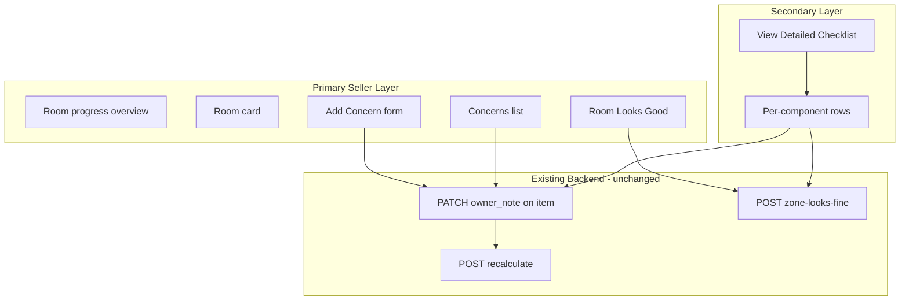

# Walkthrough Room-First Hybrid UI

## Goal

Shift the seller experience from **160 component decisions** to **~23 room decisions**, while preserving the structured inventory that powers AI evidence, ROI, and recalculation.



## Why no backend changes

The data model already supports this workflow:

| User action | Existing mechanism |
|-------------|-------------------|
| Add concern (component + observation) | `PATCH /walkthrough-items/{id}` with `owner_note`, `looks_fine: false`, `include_in_report: true` |
| Room Looks Good | `POST /walkthrough-items/zone-looks-fine` — marks all unnoted, untouched components in zone as `looks_fine` ([`zone_looks_fine_remaining`](walkthrough.py)) |
| Edit / remove concern | PATCH note or clear `owner_note` |
| Detailed checklist | Reuse current `buildWtComponentEl` + `bindWtComponent` |

Concerns are **not** a new entity — they are walkthrough rows where `owner_note` is set, grouped by `zone`.

## File scope

**Single file:** [`static/index.html`](static/index.html)

- CSS: `.wt-page`, `.wt-room`, new room-primary / concern / overview classes (~lines 541–624)
- HTML: walkthrough tab hint copy (~line 1554)
- JS: `renderWalkthrough`, progress helpers, new room builders (~lines 2547–2809)

No changes to [`walkthrough.py`](walkthrough.py), [`main.py`](main.py), or migrations.

---

## 1. Full-width layout

**Remove** the narrow-column constraint:

```552:552:static/index.html
.wt-page { max-width: 720px; }
```

Replace with:

- `.wt-page { max-width: none; width: 100%; }`
- `.wt-rooms-grid` — responsive CSS grid for room cards:
  - 1 column below 768px
  - 2 columns 768px–1199px
  - 3 columns 1200px+ (matches patterns like `.prop-two-col`, `.sc-grid` elsewhere in the file)

Room cards stretch horizontally within the grid; internal content uses full card width (concerns list, action row, add-concern panel).

---

## 2. Room-level progress (primary emphasis)

Add `deriveZoneStatus(zoneItems)`:

| Condition | Status label | CSS variant |
|-----------|--------------|-------------|
| Any `owner_note` present | `N concern(s)` | `wt-status-concerns` |
| All items reviewed, zero notes | `Reviewed` | `wt-status-reviewed` |
| Otherwise | `Not reviewed` | `wt-status-pending` |

`isWtReviewed(item)` stays as-is: note OR `looks_fine`.

**Progress header** (`renderWtProgress`):

- **Primary line:** `X / Y rooms reviewed` (count zones where every item passes `isWtReviewed`)
- **Secondary subtext:** `Z / 160 components reviewed` (keep for transparency; de-emphasize visually)
- Progress bar fill based on **room** completion (not component count)

**Room overview strip** (new `#wt-room-overview` below progress):

- Horizontal wrap / scroll of compact chips: `Bedroom 2 · Reviewed`, `Bedroom 3 · 2 concerns`, etc.
- Click chip → `scrollIntoView` on matching `.wt-room[data-zone="..."]`
- Sorted in walk order (`sort_order` of first item in zone)

---

## 3. Room card — primary layer (default visible)

Replace the current pattern (summary shows `9/9 reviewed` + every component row visible) with:

```
Bedroom 2
0 concerns noted                    [Reviewed badge]

[✓ Room Looks Good]  [+ Add Concern]

Concerns:
  (empty state: "Nothing noted yet — tap Room Looks Good if everything looks fine")

[View Detailed Checklist ▾]   ← collapsed <details> by default
```

### Room Looks Good

- Replaces hidden-in-summary `Mark rest Looks Fine` button
- Calls existing `zoneLooksFine(zone)` → reload
- **Done state:** when zone is fully reviewed with zero concerns, show `✓ Room Looks Good` (disabled / filled green) — derived from data, not a new flag
- Still works when concerns exist: bulk-marks remaining untouched components as fine (backend already skips rows with notes)

### Concerns list

- Render from `zoneItems.filter(i => owner_note.trim())`
- Each concern block:
  - **Component name** (bold)
  - **Observation text** (body)
  - Subtle **Edit** / **Remove** actions
- Edit → opens Add Concern panel pre-filled for that item
- Remove → `PATCH { owner_note: null, include_in_report: false }`

### Add Concern panel

- Toggle inline panel (not a browser modal) within the room card
- Fields:
  - **Component:** `<select>` of all components in zone (sorted by `sort_order`)
  - **Observation:** `<textarea>` (not placeholder-as-guidance; keep `assessment_prompt` as helper text below, same as current expand panel)
  - **Save** / **Cancel**
- Save logic:
  - Resolve item by `zone` + selected `component`
  - `scheduleWtPatch(id, { owner_note, looks_fine: false, include_in_report: true })`
  - Close panel, refresh concerns list
- If selected component already has a note, pre-fill textarea (edit mode)

### Collapse behavior

- Room `<details>` open by default only for **first not-reviewed** zone in each layer (not all unreviewed zones — reduces noise vs. current `open = hasUnreviewed`)
- Reviewed rooms stay collapsed unless they have concerns

---

## 4. Detailed checklist — secondary layer

Move existing per-component UI into a nested `<details class="wt-checklist">`:

- Summary text: `View Detailed Checklist (N components)`
- **Collapsed by default**
- Body: reuse existing `buildWtComponentEl` / `bindWtComponent` unchanged
- Dev/advanced computed fields remain inside checklist rows only (when `?dev=1` + Advanced checkbox)

This preserves power-user and debugging paths without exposing 9–16 decisions per room upfront.

---

## 5. Systems layer (Layer 2)

Apply the **same room-first card pattern** to systems zones (`exterior`, `hvac`, `plumbing`, etc.):

- Rename layer title from `Layer 2: Hidden Issues & Transaction Risk` → `Systems & Whole-House` (seller-friendly)
- Same concerns + Room Looks Good + checklist structure
- Overview strip includes systems zones in walk order after room layer

---

## 6. Visual hierarchy updates

| Priority | Elements | Treatment |
|----------|----------|-----------|
| Primary | Room name, concern count, concerns list, Room Looks Good, Add Concern | Larger type, white card, prominent CTAs |
| Secondary | Progress + room overview | Top-of-page summary strip |
| Tertiary | Detailed checklist, dev panel, badges | Smaller type, collapsed, muted |

Remove or rewrite bottom hint (line 1554):

> Walk each room. If nothing stands out, tap **Room Looks Good**. Otherwise tap **Add Concern** and describe what you noticed.

Drop per-component `Looks Fine | Add Observation` from the default view (they remain in detailed checklist).

---

## 7. JS refactor map

| Function | Change |
|----------|--------|
| `wtProgressStats` | Add `wtRoomProgressStats(items)` grouping by `zone` |
| `deriveZoneStatus` | **New** — room status label + kind |
| `renderWtProgress` | Room-first counts + overview strip |
| `renderWtConcernList` | **New** — concerns HTML + edit/remove handlers |
| `renderWtAddConcernPanel` | **New** — inline form + save |
| `buildWtRoomCard` | **New** — primary layer + nested checklist |
| `renderWalkthrough` | Grid of room cards instead of stacked full-expand rooms |
| `buildWtComponentEl` | Keep as-is; only called from checklist |
| `wtExpandedItems` | Repurpose: `wtConcernFormOpen` (Set of zones), `wtChecklistOpen` (Set of zones) |

Preserve: `loadWalkthrough`, `patchWtItem`, `scheduleWtPatch`, `zoneLooksFine`, `looksFineItem`, `recalculateWalkthrough`, dev toggle.

---

## 8. Testing checklist

1. Empty property: all rooms show `Not reviewed`, 0 concerns, checklist collapsed
2. **Room Looks Good** on Bedroom 2 → all 9 components `looks_fine`, room shows `Reviewed`, progress increments
3. **Add Concern** (Paint + note) → concern appears in list, item has `include_in_report=true`, Room Looks Good still marks remaining components fine
4. Edit concern → note updates; Remove → note cleared, concern disappears
5. Open **View Detailed Checklist** → per-component Looks Fine / observation still works
6. Wide viewport → 2–3 column grid, no wasted left-column whitespace
7. Existing 29 notes from prior session → render as concerns in correct rooms without migration
8. Regenerate ROI after walkthrough — evidence unchanged (same `owner_note` / `include_in_report` fields)

---

## Out of scope (future)

- New `room_reviewed` DB column (derive from components instead)
- Dedicated `POST /concern` convenience endpoint
- Room-level "undo Room Looks Good" bulk action
- Multi-concern per component (still one note per component row)
