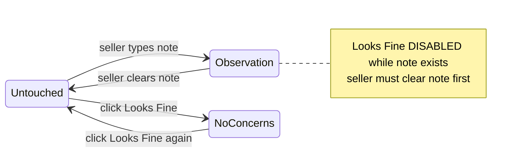

# Walkthrough UI Feedback — Fix Plan (revised)

## Design principle: state machine, not three independent fields

The seller transitions between **evidence states**. `Include` is a **routing flag** — whether this row is sent to the ROI evidence package — not a fourth mutually exclusive state, but it must be **visually represented**.



**Include** (routing flag, orthogonal to evidence state):

| Evidence state | Include default | Seller can override |
|----------------|-----------------|---------------------|
| Untouched | OFF | Yes |
| Observation | ON (auto on note entry) | Yes |
| No Concerns | OFF (convenience on Looks Fine) | Yes |

---

## Four visible states (badges)

Add a **Status** column (or inline badges) on every row:

| Badge | Meaning | Derived from |
|-------|---------|------------|
| *(none)* | **Untouched** — not evaluated | no note, `looks_fine=false` |
| `Observation` | Seller entered evidence | `owner_note` present |
| `No Concerns` | Looks Fine | `looks_fine=true` |
| `Included` | Sent to ROI evidence | `include_in_report=true` |

`Included` can coexist with `Observation` or `No Concerns` (e.g. No Concerns + Included = "seller says fine, but still route to evidence").

Badge CSS: small pills — `wt-badge-observation`, `wt-badge-fine`, `wt-badge-included`.

Legend above table:
> **Observation** = your note · **No Concerns** = looks fine · **Included** = sent to ROI · Placeholder text is guidance only.

---

## Root cause summary

| Issue | Why it happens today |
|-------|---------------------|
| Prompts appear as notes | Legacy Supabase rows where `owner_note` holds `ASSESSMENT_PROMPTS` text from an earlier pass |
| Include cannot be re-enabled | `prepare_walkthrough_row()` and `apply_calculated_persist_fields()` force `include_in_report=false` on every recalc when `looks_fine=true` |
| Looks Fine not reversible | `POST /looks-fine` only sets true; no toggle-off |
| Note lost on Looks Fine | `apply_looks_fine()` sets `owner_note: None` — **will be removed** |
| Untouched rows default Include ON | `_item()` and DB default `include_in_report=true` |

---

## 1. Separate assessment_prompt from owner_note

### Backend — [`walkthrough.py`](C:\Users\kirel\simpsonville-analyzer\walkthrough.py)

- `is_assessment_prompt_text(note, component, category)` — match against `get_assessment_prompt()` and prompt library
- `sanitize_owner_note(row)` — clear prompt text mistaken for notes; call in `enrich_walkthrough_item()`
- `POST /walkthrough-items/sanitize-prompts` — one-time DB repair for `130_kingfisher`

### UI — [`static/index.html`](C:\Users\kirel\simpsonville-analyzer\static\index.html)

- `placeholder={assessment_prompt}` only; `value` = actual `owner_note` or empty
- Never persist placeholder text on blur/save

---

## 2. Looks Fine — toggle only, never delete notes

### Rule: **Looks Fine is disabled when a note exists**

Seller must clear the note first to mark No Concerns. This prevents accidental loss of observations like *"Original laminate from 1999"*.

### API — [`main.py`](C:\Users\kirel\simpsonville-analyzer\main.py) + [`walkthrough.py`](C:\Users\kirel\simpsonville-analyzer\walkthrough.py)

**Remove** `owner_note: None` from `apply_looks_fine()`.

```python
def apply_looks_fine(row: dict) -> dict:
    if (row.get("owner_note") or "").strip():
        raise ValueError("Cannot mark Looks Fine while an observation exists — clear the note first")
    return {
        **row,
        "looks_fine": True,
        "include_in_report": False,  # convenience default only at transition
    }

def clear_looks_fine(row: dict) -> dict:
    return {**row, "looks_fine": False}
```

Toggle endpoint:
- If `looks_fine=true` → clear looks_fine (→ Untouched)
- If `looks_fine=false` and no note → apply_looks_fine (→ No Concerns)
- If note exists → **422** with message; UI should never send this (button disabled)

Zone bulk "Mark remaining as Looks Fine" — skip rows with `owner_note` (already does).

### UI — [`static/index.html`](C:\Users\kirel\simpsonville-analyzer\static\index.html)

- Looks Fine button `disabled` + `title="Clear your note first"` when `owner_note` is non-empty
- Toggle off: click `✓ Fine` → PATCH `looks_fine: false` → Untouched
- **Never** clear note from Looks Fine click

---

## 3. Include as routing flag — decoupled from recalc

### Backend — remove forced coupling

**Delete** from `prepare_walkthrough_row()` and `apply_calculated_persist_fields()`:
```python
if ... looks_fine:
    out["include_in_report"] = False
```

Convenience default **only** at Looks Fine transition in `apply_looks_fine()`. Never overwrite on subsequent PATCH/recalc.

### Evidence — [`evidence.py`](C:\Users\kirel\simpsonville-analyzer\evidence.py)

| looks_fine | include_in_report | ROI evidence |
|------------|-------------------|--------------|
| false | false | Omitted (untouched) |
| false | true | Note/photos per tier |
| true | false | DISMISSED — do not recommend |
| true | true | SELLER CONFIRMED OK — negative evidence |

`format_evidence_prompt()` must check `include_in_report` before emitting any row.

---

## 4. Observation entry transitions

When seller types a non-empty note (PATCH):

```python
updates["looks_fine"] = False   # observation and no-concerns are mutually exclusive
updates["include_in_report"] = True  # default routing on
```

When seller clears note to empty:
- Transition to **Untouched** — do not auto-set looks_fine
- Set `include_in_report = False` (routing off unless seller re-enables)

Typing a note while `looks_fine=true` should be impossible in UI (note field editable, but entering text triggers Observation transition and clears looks_fine).

---

## 5. Default state — Untouched

| Field | Untouched default |
|-------|-------------------|
| `owner_note` | null |
| `looks_fine` | false |
| `include_in_report` | false |

- `_item()` default `include_in_report=False`
- Migration `walkthrough_items_v4.sql`: column default false + backfill untouched rows

---

## 6. UI state machine helpers

Add `deriveWalkthroughState(item)` in [`static/index.html`](C:\Users\kirel\simpsonville-analyzer\static\index.html):

```javascript
function deriveWalkthroughState(item) {
  const hasNote = !!(item.owner_note || '').trim();
  if (hasNote) return 'observation';
  if (item.looks_fine) return 'no_concerns';
  return 'untouched';
}

function renderStateBadges(item) {
  const badges = [];
  const state = deriveWalkthroughState(item);
  if (state === 'observation') badges.push('Observation');
  if (state === 'no_concerns') badges.push('No Concerns');
  if (item.include_in_report) badges.push('Included');
  return badges;
}
```

Row styling:
- `wt-row-default` — untouched
- `wt-row-has-note` — observation
- `wt-row-fine` — no concerns (dimmed)

---

## Files to change

| File | Changes |
|------|---------|
| [`walkthrough.py`](C:\Users\kirel\simpsonville-analyzer\walkthrough.py) | sanitize helpers, `apply_looks_fine` no note clear + guard, `clear_looks_fine`, decouple include, default include off |
| [`main.py`](C:\Users\kirel\simpsonville-analyzer\main.py) | Toggle looks-fine with 422 if note exists, PATCH note transitions, sanitize endpoint |
| [`evidence.py`](C:\Users\kirel\simpsonville-analyzer\evidence.py) | Respect `include_in_report`; seller-confirmed-ok section |
| [`static/index.html`](C:\Users\kirel\simpsonville-analyzer\static\index.html) | State badges, disable Looks Fine when note exists, unlocked Include, legend |
| [`migrations/walkthrough_items_v4.sql`](C:\Users\kirel\simpsonville-analyzer\migrations\walkthrough_items_v4.sql) | include default false + untouched backfill |

---

## Verification checklist

1. Untouched row: no badges except none; placeholder visible; Include unchecked; Looks Fine enabled
2. Type `"Original laminate from 1999"` → `Observation` + `Included` badges; Looks Fine **disabled**
3. Accidental Looks Fine click with note → button disabled; note **preserved**
4. Clear note → Untouched; can click Looks Fine → `No Concerns` badge; Include off by default
5. Re-enable Include while No Concerns → `No Concerns` + `Included` badges; persists after save/recalc
6. Click Looks Fine again (no note) → Untouched; badges cleared
7. Prompt-only `owner_note` in DB → cleared by sanitize endpoint
8. Evidence: untouched omitted; observation in OBSERVED; no-concerns in DISMISSED unless Included

---

## Deploy order

1. Ship backend + UI
2. Run `walkthrough_items_v4.sql` in Supabase
3. `POST /walkthrough-items/sanitize-prompts` for `130_kingfisher`
4. Seller refreshes walkthrough tab

**Approved for implementation** — note-protection and state-machine model incorporated.
