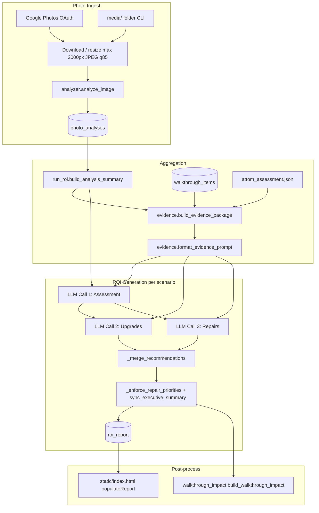

# Recommendation Pipeline Audit

**Property:** 130 Kingfisher Dr, Simpsonville SC 29680 (`property_id`: `130_kingfisher`)  
**Audit date:** June 16, 2026  
**Scope:** Read-only analysis of the full recommendation generation pipeline. No code was modified.

---

## Table of Contents

1. [End-to-End Recommendation Flow](#1-end-to-end-recommendation-flow)
2. [Recommendation Sources](#2-recommendation-sources)
3. [Photo Analysis Pipeline](#3-photo-analysis-pipeline)
4. [Prompt Inventory](#4-prompt-inventory)
5. [Report Generation Pipeline](#5-report-generation-pipeline)
6. [Configuration Locations](#6-configuration-locations)
7. [Improvement Opportunities](#7-improvement-opportunities)

---

## 1. End-to-End Recommendation Flow

### 1.1 High-Level Architecture

The system has two conceptual layers:

| Layer | Surface | Question answered |
|-------|---------|-------------------|
| **Evidence** | Walkthrough tab | What is true about this house? |
| **Decision** | ROI tab | Given budget scenario X, what should the seller spend on? |

Final ROI recommendations are **not** copied directly from walkthrough buckets. They are produced by **three sequential LLM text calls per budget scenario**, grounded in aggregated photo data, formatted walkthrough evidence, property metadata, and hardcoded cost/comp anchors.

The active LLM client is **`claude_client.py`** (Anthropic). `gemini_client.py` exists but is **not imported** by any production module.

### 1.2 Entry Points

| Entry | File | Trigger | First function called |
|-------|------|---------|----------------------|
| Web — single photo | `main.py` | `POST /analyze` | `_download_and_analyze()` → `analyzer.analyze_image()` |
| Web — bulk photos | `main.py` | `POST /analyze/bulk` | Loop: `get_photo_bytes()` → `analyze_image()` → Supabase upsert |
| CLI — local/media batch | `run_analysis.py` | `python run_analysis.py` | `scan_files()` → `analyze_image()` → Supabase upsert |
| CLI — video frames | `run_analysis.py` | Video in `media/` | `extract_video_frames()` → `analyze_image()` per frame |
| Web — ROI report | `main.py` | `POST /report` | `build_analysis_summary()` → `generate_roi_report()` |
| CLI — ROI report | `run_roi.py` | `python run_roi.py` | Same as web |
| Web — regenerate all | `main.py` | `POST /report/regenerate-all` | Full chain for all 4 budget levels |
| Streamlit (legacy) | `app.py` | Local UI | `analyze_image()` → CSV only (not main pipeline) |

**Prerequisite:** ROI report generation requires at least one row in `photo_analyses`. Walkthrough data is optional but strongly influences evidence when `include_in_report=true`.

### 1.3 Exact Execution Sequence (ROI Report)

When `POST /report` is called with `{ detail_level, buyer_profile }`:

```
1. Load photo analyses
   └─ main._load_photo_analyses()
      ├─ Try in-memory analysis_cache
      └─ Fallback: Supabase photo_analyses.analysis

2. Aggregate photo findings
   └─ run_roi.build_analysis_summary(analyses)
      └─ Returns capped frequency dicts, room groupings, critical/high lists

3. Load property metadata
   └─ attom.get_property_summary()  → attom_assessment.json
   └─ attom.get_last_sale()         → attom_sales.json

4. Determine additive chain
   └─ roi.levels_up_to(detail_level)
      └─ e.g. budget_15k → [spend_nothing, budget_5k, budget_15k]

5. FOR EACH level in chain:
   │
   ├─ 5a. Build evidence package
   │      └─ main._evidence_context(sb, level)
   │         ├─ walkthrough.load_walkthrough_items(sb, "130_kingfisher")
   │         ├─ build_analysis_summary (already done; reused)
   │         ├─ evidence.build_evidence_package(rows, summary, default_property_facts())
   │         └─ evidence.format_evidence_prompt(package, level) → walkthrough_block string
   │
   ├─ 5b. Generate ROI report (3 LLM calls)
   │      └─ roi.generate_roi_report(summary, property_summary, last_sale, ...)
   │         ├─ CALL 1: _build_assessment_prompt() → executive_summary, deal_killers, timeline
   │         ├─ CALL 2: _build_upgrades_prompt()    → upgrades[]
   │         ├─ CALL 3: _build_repairs_prompt()     → repairs[]
   │         ├─ _merge_recommendations() (prior + new, dedup, cap)
   │         ├─ _normalize_upgrade() (recalc roi_percent)
   │         ├─ _enforce_repair_priorities()
   │         └─ _sync_executive_summary() (override ARV/investment math)
   │
   ├─ 5c. Attach traceability
   │      └─ main._attach_walkthrough_impact()
   │         └─ walkthrough_impact.build_walkthrough_impact()
   │
   └─ 5d. Persist
          └─ Supabase roi_report upsert id = "{level}_{buyer_profile}"

6. Return final report (highest level in chain) to client
```

### 1.4 Per-Photo Analysis Sequence

When a single photo is analyzed (`analyzer.analyze_image`):

```
1. Validate file extension (.jpg, .jpeg, .png, .webp, .heic)
2. Load image (HEIC via pillow-heif if available)
3. Convert to RGB; resize longest side ≤ 2000px; JPEG quality 85
4. claude_client.generate_vision(image_bytes, mime_type, USER_PROMPT, system=SYSTEM_PROMPT, max_tokens=2048)
5. Parse JSON response → dict with room_type, condition, issues, upgrades, etc.
6. Persist to photo_analyses (web/CLI) or analysis_cache (web bulk, in-memory only)
```

### 1.5 Data Flow Diagram



### 1.6 Budget Scenario Additivity

Each higher budget level receives `prior_report` from the level below. The LLM is instructed to **include all prior items** and the merge step enforces:

- Prior items always appear first
- Cost fields anchored to first-seen (lower-level) version
- New items appended up to `max_upgrades` / `max_repairs`

| Level | Chain position | Prior report source |
|-------|----------------|---------------------|
| `spend_nothing` | 1 | None |
| `budget_5k` | 2 | `spend_nothing` report |
| `budget_15k` | 3 | `budget_5k` report |
| `maximize` | 4 | `budget_15k` report |

---

## 2. Recommendation Sources

### 2.1 Where Recommendations Originate

| Source | What it produces | Feeds ROI recommendations? |
|--------|------------------|---------------------------|
| **Vision LLM** (`analyzer.py`) | Per-photo: issues, upgrades, dated_features, inspection_flags, deal_risk | Yes — via `build_analysis_summary` |
| **Walkthrough seller notes** (`walkthrough_items`) | Owner observations with `include_in_report=true` | Yes — via `format_evidence_prompt` |
| **Property metadata** (`attom.py`, `evidence.default_property_facts`) | Year built, sqft, AVM | Yes — inferred-tier gap filler only |
| **Hardcoded facts** (`roi._KNOWN_REPAIR_FACTS`) | Photo-confirmed garage door, window scope | Yes — injected into repairs prompt |
| **Cost anchors** (`roi._GREENVILLE_COST_ANCHORS`) | 60+ installed cost ranges | Yes — constrains LLM pricing |
| **Comp data** (`roi._PROPERTY_CONTEXT`, `_ARV_BY_LEVEL`) | ARV ceiling, comps | Yes — assessment + post-sync |
| **Walkthrough rule engine** (`walkthrough.py`) | priority_score, recommendation_bucket, report_type | **No** — UI/display only |
| **Inventory pass** (`analyzer.INVENTORY_PROMPT`, `run_inventory.py`) | Door/outlet/fixture counts | **No** — separate shopping list tab |

### 2.2 AI vs Rules-Based Breakdown

| Stage | AI-generated | Rules/heuristics/templates |
|-------|--------------|---------------------------|
| Per-photo findings | Vision LLM analyzes each image | Resize (2000px), JPEG q85, extension check |
| Issue/upgrade aggregation | — | `_norm_key()` dedup, deal-risk weights, frequency caps |
| Walkthrough condition/action | — | Keyword inference (`infer_condition_from_owner_note`, `infer_action`) |
| Evidence confidence tiers | — | `_agree()`, `_classify_tier()`, zone/component photo matching |
| ROI upgrades/repairs list | 3 text LLM calls per scenario | Merge, dedup, priority enforcement, ARV sync |
| Upgrade ROI % | LLM proposes `estimated_value_add` | `_normalize_upgrade()` recalculates `roi_percent` |
| Executive summary math | LLM drafts narrative | `_sync_executive_summary()` overrides numeric fields |
| Repair priority | LLM assigns priority | `_enforce_repair_priorities()` bumps to critical when matched |
| Deep item detail | LLM on demand (`get_item_detail`) | Supabase cache in `upgrade_details` |
| Walkthrough buckets | — | `calculate_walkthrough_fields()` → Fix/Upgrade/Leave Alone |

### 2.3 Merge, Dedup, Rank, and Filter

#### Deduplication keys

| Layer | Function | Key algorithm |
|-------|----------|---------------|
| Photo aggregation | `run_roi._norm_key()` | Lowercase, strip punctuation, drop stop words/digits, first 5 content words |
| ROI item merge | `roi._norm_name()` | Lowercase, strip non-alphanumeric, collapse whitespace |

#### Merge logic (`roi._merge_recommendations`)

1. Start with all `prior` items (from lower budget level)
2. For each new item, skip if `_norm_name(name)` already seen
3. If duplicate name in new batch, preserve cost fields from prior version
4. Sort new extras by `sort_key` (upgrades: `roi_percent` desc; repairs: priority asc)
5. Truncate to `max_count`

#### Ranking (final display order)

| Item type | Sort key | Direction |
|-----------|----------|-----------|
| Upgrades | `roi_percent` | Descending (highest ROI first) |
| Repairs | `priority` | Ascending (critical → high → medium → low) |

Frontend (`static/index.html` `populateReport`) re-sorts the same way before render.

#### Filters and limits

| Filter | Location | Rule |
|--------|----------|------|
| Recommendation count | `_RECOMMENDATION_LIMITS` | Per-level max upgrades/repairs |
| Evidence tier | `_SCENARIO_TIER_RULES` | spend_nothing excludes inferred |
| Walkthrough gate | `include_in_report` | Only included rows enter evidence prompt |
| `looks_fine` | evidence + walkthrough_impact | Treated as negative evidence / dismissed |
| Photo-only cap | `build_evidence_package` | Max 15 unmatched photo findings |
| Photo match cap | `_match_photo_texts` | Max 5 matches per walkthrough component |

#### Evidence precedence

**walkthrough > photos > metadata** on conflict (`format_evidence_prompt` header).

Confidence tiers:

| Tier | Classification rule |
|------|---------------------|
| `confirmed` | Walkthrough note + photo observations agree (`_agree()`) |
| `observed` | Walkthrough note OR photo match, not both agreeing |
| `inferred` | Property metadata only (e.g. "built 1999") |
| `unknown` | `looks_fine=true` or no data |

---

## 3. Photo Analysis Pipeline

### 3.1 Photo Discovery

| Source | Discovery method | Limits |
|--------|------------------|--------|
| **Google Photos (web)** | OAuth → `GET /photos/albums` → `GET /photos/list?album_id=` | Albums paginated 50/page; photos 100/page; **no hard cap** on total |
| **Local CLI** | `run_analysis.scan_files()` recurses `media/` (or repo root) | Skips `.git`, `node_modules`, `__pycache__`, `.venv` |
| **Video** | `.mp4` in media → `extract_video_frames()` | ffmpeg: 1 frame / 5 seconds → `.video_frames/` |

Supported image types: `.jpg`, `.jpeg`, `.png`, `.webp`, `.heic`

### 3.2 Photos Sent to AI

**Every discovered photo** (that passes download/load) is sent individually to the vision model. There is:

- No batching of multiple images per API call
- No selective sampling (all photos in album/bulk request are analyzed)
- No re-ranking of which photos to analyze first (sequential order)

**Bulk analyze skip logic** (`POST /analyze/bulk`):

- Skips only if `photo_id` exists in **in-memory** `analysis_cache`
- Does **not** check Supabase — server restart can re-analyze already-persisted photos

**CLI skip logic** (`run_analysis.py`):

- Skips rows already in Supabase by filename id
- `--reanalyze-outdated` re-analyzes rows missing `dated_features` field

### 3.3 Image Preprocessing (before AI)

| Step | Value |
|------|-------|
| Color space | Convert to RGB |
| Max dimension | 2000px (longest side, `Image.LANCZOS` thumbnail) |
| Output format | JPEG quality 85 |
| HEIC | Converted via `pillow-heif` if installed |

**Google Photos download:**

- Thumbnail: `baseUrl=w{width}-h{width}` (default 400px for UI)
- Full resolution for analysis: `baseUrl=d` (`width=0` in `get_photo_bytes`)

### 3.4 Photo Grouping (downstream, not at vision time)

Photos are **not** grouped before vision analysis. Grouping happens during aggregation:

| Grouping | Function | Logic |
|----------|----------|-------|
| By room | `build_analysis_summary` | Uses freeform `room_type` from each photo |
| Canonical rooms | `aggregate_inventory` | `_ROOM_ALIASES` maps 50+ variants → 14 canonical rooms |
| Issue dedup | `_norm_key()` | Collapses verbose sentences across photos |
| Walkthrough linkage | `evidence._match_photo_texts()` | Zone aliases + component keyword substring match |

**Room alias example:** `"master bathroom"` → `"primary bathroom"` (inventory only; ROI summary uses raw `room_type`)

### 3.5 Aggregation Limits (token caps for ROI prompts)

| Summary field | Limit |
|---------------|-------|
| `issues_by_frequency` | Top **30** by weighted score |
| `critical_and_high_issues` | **Uncapped** (all from critical/high deal_risk photos) |
| `upgrades_by_frequency` | Top **30** by raw count |
| `dated_features_by_frequency` | Top **20** + always pin jetted/jacuzzi/garden tub |
| `issues_by_room` | Top **5** per room, max **10** rooms |
| `upgrades_by_room` | Top **5** per room, max **10** rooms |
| `inspection_flags_by_frequency` | Top **20** |
| `critical_and_high_flags` | All from critical/high photos |
| `photo_only_findings` (evidence) | Max **15** |

**Issue weighting** (`_DEAL_RISK_WEIGHT`):

| deal_risk | Weight |
|-----------|--------|
| critical | 10.0 |
| high | 5.0 |
| medium | 2.0 |
| low | 1.0 |
| none / unknown | 0.5 |

### 3.6 Vision Output Schema

Each photo analysis returns:

```json
{
  "room_type": "kitchen",
  "condition": "fair",
  "finish_quality": "builder_grade",
  "dated_features": ["..."],
  "issues": ["..."],
  "deal_risk": "medium",
  "upgrades": ["..."],
  "buyer_psychology_notes": ["..."],
  "inspection_flags": ["..."],
  "photo_quality": "good"
}
```

### 3.7 How Photo Findings Influence Recommendations

1. **Direct:** Aggregated issues/upgrades/flags injected into ROI prompts (`_freq_block`, `_list_block`)
2. **Critical/high bypass:** `critical_and_high_issues` always sent to repairs prompt (uncapped)
3. **Evidence layer:** Photo texts matched to walkthrough components → CONFIRMED/OBSERVED tiers
4. **Photo-only:** Unmatched findings appended as `[Photo] ...` in OBSERVED section (max 15)
5. **Ground truth:** `_KNOWN_REPAIR_FACTS` hardcodes scope for garage door and window from photos
6. **NOT used:** `buyer_psychology_notes` is extracted by vision but **never aggregated** into summary or prompts

### 3.8 Parallel Inventory Pipeline

A second vision pass (`analyze_image_inventory` with `INVENTORY_PROMPT`) counts physical items. This feeds the **Inventory tab** only, not ROI recommendations. Run via `run_inventory.py` or when inventory column is populated.

---

## 4. Prompt Inventory

All prompts are **inline Python string constants** — there are no separate `.txt` or `.md` prompt files.

### 4.1 Master Prompt Table

| # | Location | Variable / Builder | Model call | Purpose |
|---|----------|-------------------|------------|---------|
| 1 | `analyzer.py` | `SYSTEM_PROMPT` | Vision | Forensic inspector persona, Greenville $295–305K buyer |
| 2 | `analyzer.py` | `USER_PROMPT` | Vision | Per-photo condition JSON schema |
| 3 | `analyzer.py` | `INVENTORY_PROMPT` | Vision | Physical item counts (separate pipeline) |
| 4 | `roi.py` | `SYSTEM_PROMPT` | Text | Licensed agent/renovation consultant persona |
| 5 | `roi.py` | `_build_assessment_prompt()` | Text | Call 1: executive summary, deal killers, timeline |
| 6 | `roi.py` | `_build_upgrades_prompt()` | Text | Call 2: upgrades array |
| 7 | `roi.py` | `_build_repairs_prompt()` | Text | Call 3: repairs array |
| 8 | `roi.py` | `_detail_block()` | Injected | Budget scenario rules per level |
| 9 | `roi.py` | `_comp_anchoring_block()` | Injected | ARV/comps framing |
| 10 | `roi.py` | `_profile_block()` | Injected | Six buyer profile instructions |
| 11 | `roi.py` | `_RATIONALE_INSTRUCTION` | Injected | Required `rationale` object on every item |
| 12 | `roi.py` | `_PROPERTY_CONTEXT` | Injected | Hardcoded 130 Kingfisher facts + comps |
| 13 | `roi.py` | `_GREENVILLE_COST_ANCHORS` | Injected | 60+ installed cost ranges |
| 14 | `roi.py` | `_KNOWN_REPAIR_FACTS` | Injected | Photo-confirmed ground truth |
| 15 | `roi.py` | `_REPAIR_SEVERITY_RULES` | Injected | Critical vs high classification |
| 16 | `roi.py` | `_prior_items_block()` | Injected | Additive carry-forward from prior budget level |
| 17 | `roi.py` | `get_item_detail()` inline | Text | On-demand how-to detail |
| 18 | `evidence.py` | `format_evidence_prompt()` | Assembled string | CONFIRMED / OBSERVED / INFERRED / DISMISSED |
| 19 | `evidence.py` | `_SCENARIO_TIER_RULES` | Injected | Per-scenario tier inclusion rules |
| 20 | `walkthrough.py` | `ASSESSMENT_PROMPTS` | UI only | ~25 component placeholder guidance strings |
| 21 | `walkthrough.py` | `_CATEGORY_PROMPTS` | UI only | Fallbacks by category |
| 22 | `walkthrough.py` | `build_walkthrough_prompt_block()` | Legacy | Superseded by `evidence.py` |

**Prompt version / cache staleness:** `roi.PROMPT_VERSION` = first 8 chars of SHA1(`_GREENVILLE_COST_ANCHORS`). Exposed via `GET /report/status`.

### 4.2 Variables Injected Into Each Prompt

#### Vision — `analyzer.analyze_image`

| Variable | Source | Notes |
|----------|--------|-------|
| `system` | `SYSTEM_PROMPT` (static) | Greenville County inspector persona |
| User content | Image bytes (base64) + `USER_PROMPT` (static) | No runtime variable substitution |

#### ROI Call 1 — Assessment (`_build_assessment_prompt`)

| Injected block | Dynamic content |
|----------------|-----------------|
| `_detail_block(detail_level)` | Budget scenario label + rules |
| `_comp_anchoring_block(detail_level)` | ARV ceiling framing |
| `_profile_block(buyer_profile)` | One of 6 buyer profiles |
| `_PROPERTY_CONTEXT` | Static property + comps |
| Photo summary stats | `total_photos`, `total_unique_issues`, condition/finish/risk distributions |
| `_freq_block(dated_freq, 15)` | Top 15 dated features |
| `_freq_block(issues_freq, top_issues)` | Top N issues (10–20 by level) |
| `_freq_block(upgrades_freq, top_upgrades)` | Top N upgrades (8–20 by level) |
| Room breakdown | Issues/upgrades by room (omitted at `maximize` level) |
| `_REPAIR_SEVERITY_RULES` | Static |
| ARV instruction | `_comp_anchored_arv(detail_level)` numeric value |
| Current value instruction | `_DEFAULT_MARKET_VALUE` ($276,810) |

**Not injected:** walkthrough evidence block (assessment uses photo summary only).

#### ROI Call 2 — Upgrades (`_build_upgrades_prompt`)

| Injected block | Dynamic content |
|----------------|-----------------|
| All assessment blocks | `_detail_block`, `_comp_anchoring_block`, `_profile_block`, `_PROPERTY_CONTEXT`, `_GREENVILLE_COST_ANCHORS` |
| `walkthrough_block` | Full output of `format_evidence_prompt(package, detail_level)` |
| `executive_summary` | JSON from Call 1 |
| `_freq_block(issues_freq, top_issues)` | Top N issues |
| `_freq_block(upgrades_freq, top_upgrades)` | Top N upgrades |
| Dated jetted tub section | Only at `maximize` if jetted/jacuzzi found |
| `_prior_items_block(prior_report, detail_level)` | Prior level upgrades + repairs JSON |
| `_upgrades_instructions(detail_level, prior_count)` | Max count, budget cap, sort rules |

#### ROI Call 3 — Repairs (`_build_repairs_prompt`)

| Injected block | Dynamic content |
|----------------|-----------------|
| Same as upgrades | Plus `_KNOWN_REPAIR_FACTS`, `_REPAIR_SEVERITY_RULES` |
| `critical_and_high_issues` | Full list (uncapped) |
| `critical_and_high_flags` | Up to 20 inspector flags |
| `_repairs_instructions(detail_level, prior_count)` | Max count, severity sort |

#### Evidence — `format_evidence_prompt(package, scenario)`

| Section | Built from |
|---------|------------|
| Tier rules | `_SCENARIO_TIER_RULES[scenario]` |
| CONFIRMED | Components with `confidence_tier=confirmed` and `include_in_report=true` |
| OBSERVED | Single-source walkthrough or photo; plus `photo_only_findings` |
| INFERRED | Metadata-only components |
| SELLER CONFIRMED OK | `looks_fine` rows with notes |
| DISMISSED | `looks_fine` without notes |
| PROPERTY FACTS | `package.property_facts` |

#### On-demand detail — `get_item_detail(name, item_type, description, issues)`

| Variable | Source |
|----------|--------|
| `name` | Query param from frontend |
| `description`, `issues` | From report row context |
| `_GREENVILLE_COST_ANCHORS` | Static |
| `_ITEM_DETAIL_SCHEMA` | Static JSON schema |

### 4.3 Assembled Prompt Examples (abbreviated)

#### Example A — Vision user prompt (static, no variables)

```
Analyze this photo of a house interior or exterior. Return a JSON object with exactly
these fields and no others:

- room_type: string — be specific: "master bathroom", "kitchen", ...
- condition: string — one of: excellent, good, fair, poor
- finish_quality: string — one of: builder_grade, mid_range, high_end, unknown
- dated_features: list of strings — ...
- issues: list of strings — ...
- deal_risk: string — one of: none, low, medium, high, critical
- upgrades: list of strings — ...
- buyer_psychology_notes: list of strings — ...
- inspection_flags: list of strings — ...
- photo_quality: string — ...

Return only valid JSON. No explanation, no markdown, no preamble.
```

#### Example B — Evidence block (runtime-assembled)

```
EVIDENCE SOURCES (read in this order)
--------------------------------------
1. Walkthrough observations — HIGHEST confidence; seller ground truth
2. Photo analysis findings — MEDIUM confidence; supplemental where walkthrough is silent
3. Property metadata — LOWEST confidence; gap-filler only

If sources conflict, prefer walkthrough observations.

Prioritize Confirmed, then Observed, then selective Inferred.

CONFIRMED FINDINGS (multiple sources agree)
--------------------------------------------
- [Kitchen] Countertop: walkthrough="Original laminate, stained near sink" photo="Laminate countertop with visible wear and staining near sink area"

OBSERVED FINDINGS (single direct source)
-----------------------------------------
- [Garage] Garage door: "Structural crack penetrating panel with spider-web fracture" (photo)
- [Photo] Brown water stain on ceiling approximately 12 inches diameter near HVAC vent

INFERRED FINDINGS (metadata only — low confidence)
--------------------------------------------------
- [Whole House] HVAC: House built 1999; age may affect remaining useful life (inferred)

PROPERTY FACTS
--------------
Built 1999 | 2019 sqft | 3 bed / 2 bath | 130 Kingfisher Dr, Simpsonville SC 29680
```

#### Example C — Upgrades prompt header (runtime variables shown as placeholders)

```
You are preparing upgrade recommendations for 130 Kingfisher Dr, Simpsonville SC.
This is CALL 2 OF 3. Return ONLY the upgrades array — no repairs, no other fields.

BUDGET SCENARIO: $15,000 Budget
-----------------------
Seller question: I have $15,000 — what should I spend it on?
Budget: stay within $5,000–$15,000 total investment.
...

{walkthrough_block — see Example B}

ASSESSMENT CONTEXT (from prior analysis)
-----------------------------------------
{
  "current_value": 276810,
  "estimated_arv": 300000,
  "total_investment_low": ...,
  ...
}

TOP 20 ISSUES BY WEIGHTED SCORE
------------------------------------------
  [ 45.0 pts]  Brown water stain on ceiling near HVAC vent suggesting past leak
  [ 25.0 pts]  Laminate countertops with visible wear in kitchen
  ...

TOP 18 UPGRADE OPPORTUNITIES BY FREQUENCY
-------------------------------------------------------
  [  8x]  Replace laminate countertops with quartz or granite
  [  6x]  Interior paint refresh — walls and trim throughout
  ...

INSTRUCTIONS
------------
1. Return max 6 upgrades total sorted by roi_percent descending (highest ROI first)
...
```

### 4.4 LLM Client Configuration

| Setting | Env var | Default |
|---------|---------|---------|
| API key | `ANTHROPIC_API_KEY` | Required |
| Vision model | `CLAUDE_VISION_MODEL` or `CLAUDE_MODEL` | `claude-sonnet-4-6` |
| Text model | `CLAUDE_TEXT_MODEL` or `CLAUDE_MODEL` | `claude-sonnet-4-6` |
| Detail model | `CLAUDE_DETAIL_MODEL` or `CLAUDE_MODEL` | `claude-sonnet-4-6` |
| Vision max tokens | Hardcoded | 2048 (condition), 512 (inventory) |
| Text max tokens | Hardcoded | 8192 (reports), 4096 (detail) |
| Temperature | Hardcoded | 0 |

**Note:** Error messages in `analyzer.py` and `roi.py` still reference `GEMINI_API_KEY` in some paths despite using `claude_client.get_api_key()` → `ANTHROPIC_API_KEY`.

---

## 5. Report Generation Pipeline

### 5.1 Three-Call ROI Structure

| Call | Output fields | Post-processing |
|------|---------------|-----------------|
| **1 — Assessment** | `executive_summary`, `deal_killers`, `project_timeline`, `sc_considerations`, `buyer_profile_notes` | ARV forced in prompt; final numbers synced in step 5 |
| **2 — Upgrades** | `upgrades[]` with `rationale`, costs, `roi_percent` | Merge with prior; sort by ROI; normalize ROI % |
| **3 — Repairs** | `repairs[]` with `rationale`, priority, disclosure flags | Merge with prior; enforce priorities |

### 5.2 Recommendation Limits Per Level

| Level | Max upgrades | Max repairs |
|-------|-------------|-------------|
| `spend_nothing` | 1 | 4 |
| `budget_5k` | 4 | 3 |
| `budget_15k` | 6 | 5 |
| `maximize` | 10 | 8 |

### 5.3 Input Counts to Prompts (`_INPUT_COUNTS`)

| Level | Top issues | Top upgrades |
|-------|-----------|--------------|
| `spend_nothing` | 10 | 8 |
| `budget_5k` | 15 | 12 |
| `budget_15k` | 20 | 18 |
| `maximize` | 20 | 20 |

### 5.4 Priority Scoring

#### Repairs (ROI report)

| Priority | Order value | Assignment |
|----------|-------------|------------|
| critical | 0 | LLM + `_enforce_repair_priorities()` bump |
| high | 1 | LLM |
| medium | 2 | LLM |
| low | 3 | LLM |

`_enforce_repair_priorities` sets `priority=critical` when:

- `safety_concern=true`, OR
- Token overlap (≥2 words) with `critical_and_high_issues`, OR
- Matches `_CRITICAL_REPAIR_TOKENS` patterns (water, garage+door, window+glass, etc.)

#### Walkthrough priority (UI only, not used in evidence sort)

`walkthrough.calculate_priority_score()` — weighted 0–100:

| Factor | Weight source |
|--------|---------------|
| Condition score (1–5) | `_CONDITION_WEIGHTS`: replace=40, poor=30, fair=15, good=5, unknown=0 |
| Buyer visibility | high=25, medium=12, low=3 |
| Inspection risk | high=30, medium=15, low=3 |
| Action | fix=20, upgrade=12, assess=8, skip=-30 |

### 5.5 ROI Scoring

| Field | Source | Formula |
|-------|--------|---------|
| `estimated_cost` | LLM (anchored to `_GREENVILLE_COST_ANCHORS`) | materials + labor or total |
| `estimated_value_add` | LLM | Dollar value added to sale price |
| `roi_percent` | LLM, then normalized | `(value_add - cost) / cost * 100`, rounded 1 decimal |

`_normalize_upgrade()` recalculates `roi_percent` from cost and value_add after merge.

### 5.6 Cost Estimation Logic

| Layer | Mechanism |
|-------|-----------|
| **LLM pricing** | Prompted with `_GREENVILLE_COST_ANCHORS` (60+ line-item ranges for Greenville SC) |
| **Walkthrough UI** | `_estimate_cost_range()` substring match on `_COMPONENT_COST_ANCHORS` |
| **Executive summary** | `_sync_executive_summary()` sums line-item `estimated_cost` fields |

**Executive summary overrides** (`_sync_executive_summary`):

```
current_value      ← ATTOM AVM (property_summary.market_value)
estimated_arv      ← _ARV_BY_LEVEL[detail_level] (hardcoded comp anchors)
total_investment   ← sum(upgrade.estimated_cost) + sum(repair.estimated_cost)
total_investment_high ← investment * 1.10
net_gain_low       ← ARV - market - investment * 1.10
net_gain_high      ← ARV - market - investment
```

**Comp-anchored ARV ceilings:**

| Level | ARV |
|-------|-----|
| spend_nothing | $295,000 |
| budget_5k | $298,000 |
| budget_15k | $300,000 |
| maximize | $305,000 |

### 5.7 Final Report Schema

Persisted to `roi_report` table as JSONB:

```json
{
  "detail_level": "budget_15k",
  "buyer_profile": "general",
  "level_description": "...",
  "buyer_profile_notes": ["..."],
  "executive_summary": { "current_value", "estimated_arv", "total_investment_low", ... },
  "project_timeline": { "total_weeks_hired", "recommended_sequence", ... },
  "deal_killers": ["..."],
  "sc_considerations": ["..."],
  "upgrades": [{ "name", "description", "estimated_cost", "roi_percent", "rationale", ... }],
  "repairs": [{ "name", "description", "estimated_cost", "priority", "rationale", ... }],
  "walkthrough_impact": { "summary", "items": [...] },
  "generated_at": "ISO8601",
  "prompt_version": "abc12345"
}
```

### 5.8 Frontend Report Rendering

`static/index.html` → `populateReport(report)`:

1. Display comp-anchored ARV card (static per level, not recalculated client-side)
2. Render executive recommendation and deal killers
3. Sort upgrades by `roi_percent` desc; repairs by priority asc
4. Render `walkthrough_impact` traceability section
5. Display timeline and SC considerations
6. User can uncheck items (client-side only; does not persist)
7. Deep detail fetched on demand via `GET /upgrade-detail` or `GET /repair-detail`

### 5.9 Walkthrough Impact Traceability

`walkthrough_impact.build_walkthrough_impact()` runs after report generation:

- Only rows with `owner_note` + `include_in_report=true`
- Matches walkthrough citations in upgrade/repair `rationale.evidence` where `source=walkthrough`
- Reports `influenced` recommendations or `not_selected_reason`
- Sorted: influenced first, then by zone/component

---

## 6. Configuration Locations

### 6.1 Environment Variables

| Variable | Used by | Purpose |
|----------|---------|---------|
| `ANTHROPIC_API_KEY` | `claude_client.py` | **Active** LLM API key |
| `CLAUDE_VISION_MODEL` | `claude_client.py` | Vision model override |
| `CLAUDE_TEXT_MODEL` | `claude_client.py` | ROI report model override |
| `CLAUDE_DETAIL_MODEL` | `claude_client.py` | Item detail model override |
| `CLAUDE_MODEL` | `claude_client.py` | Global model override for all calls |
| `GEMINI_API_KEY` / `GOOGLE_API_KEY` | `gemini_client.py` only | Unused alternate client |
| `SUPABASE_URL` | `main.py`, `photos.py`, CLIs | Database |
| `SUPABASE_SERVICE_KEY` | Same | Service role key |
| `GOOGLE_CREDENTIALS_JSON` | `photos.py` | OAuth client config (JSON string) |
| `google_credentials.json` | `photos.py` | OAuth client config (file fallback) |
| `GOOGLE_TOKEN_JSON` | `photos.py` | OAuth token seed |
| `google_token.json` | `photos.py` | OAuth token (local dev) |
| `REDIRECT_URI` | `photos.py` | OAuth callback (default `http://localhost:8000/auth/callback`) |

### 6.2 Python Modules (Behavior Control)

| File | Controls |
|------|----------|
| `analyzer.py` | Vision prompts, image preprocessing, video frame extraction |
| `roi.py` | ROI prompts, cost anchors, comp data, merge/rank/sync logic, buyer profiles, budget scenarios |
| `run_roi.py` | Photo aggregation (`build_analysis_summary`), inventory aggregation, CLI entry |
| `evidence.py` | Evidence package, tier rules, zone/component photo matching |
| `walkthrough.py` | ~130-component template, inference rules, UI prompts, walkthrough cost anchors |
| `walkthrough_impact.py` | Observation → recommendation traceability |
| `claude_client.py` | LLM client, model selection, JSON parse/retry |
| `gemini_client.py` | Alternate client (unused) |
| `photos.py` | Google Photos OAuth and download |
| `attom.py` | Property AVM/specs from cached JSON |
| `main.py` | API orchestration, caching, endpoint wiring |

### 6.3 Data Files

| Path | Role |
|------|------|
| `attom_assessment.json` | ATTOM property assessment (AVM, beds, baths, sqft, year built) |
| `attom_sales.json` | Sale history |
| `media/` | Local photos for CLI analysis |
| `.video_frames/` | Extracted video frames |

### 6.4 Database Tables (Supabase)

| Table | Role |
|-------|------|
| `photo_analyses` | Per-photo vision results (+ optional `inventory`, `base_url`) |
| `walkthrough_items` | Seller checklist rows |
| `roi_report` | Cached ROI reports (`id` = `{level}_{profile}`) |
| `upgrade_details` | Cached on-demand item detail |
| `oauth_tokens` | Google Photos OAuth token |
| `inventory_overrides` | User-edited room counts |
| `notes` | Freeform seller notes (`130_kingfisher`) |

### 6.5 Migrations

| File | Change |
|------|--------|
| `migrations/walkthrough_items.sql` | Initial schema |
| `migrations/walkthrough_items_v2.sql` | Schema extensions |
| `migrations/walkthrough_items_v3.sql` | Further extensions |
| `migrations/walkthrough_items_v4.sql` | `include_in_report` default **false**; backfill untouched rows |

### 6.6 Templates and Rule Engines

| Engine | Location | Rules |
|--------|----------|-------|
| Walkthrough template | `walkthrough._ROOM_ZONES`, `_SYSTEMS_ZONES` | ~130 components across room + systems layers |
| Owner note seeds | `walkthrough.OWNER_NOTE_SEEDS` | Pre-filled observations for 130 Kingfisher |
| Condition inference | `walkthrough.infer_condition_from_owner_note()` | Keyword lists: `_DEFECT_KEYWORDS`, `_AGING_KEYWORDS`, etc. |
| Action inference | `walkthrough.infer_action()` | Maps condition + category + risk → fix/upgrade/assess/skip |
| Recommendation bucket | `walkthrough._derive_recommendation_bucket()` | Fix Before Listing / Consider Upgrading / Leave Alone |
| Evidence tiers | `evidence._classify_tier()` | confirmed / observed / inferred / unknown |
| Photo matching | `evidence._ZONE_ROOM_ALIASES`, `_COMPONENT_PHOTO_KEYS` | Substring + alias matching |
| Repair severity | `roi._REPAIR_SEVERITY_RULES`, `_enforce_repair_priorities()` | Critical/high classification |
| Budget scenarios | `roi._detail_block()`, `_SCENARIO_TIER_RULES` | Per-level inclusion rules |
| Buyer profiles | `roi._profile_block()`, `BUYER_PROFILES` | 6 profile-specific prompt blocks |

### 6.7 UI Configuration

| File | Role |
|------|------|
| `static/index.html` | SPA: tabs, report rendering, walkthrough CRUD, sort defaults |
| `docs/architecture.md` | System design reference (notes Gemini; code uses Claude) |
| `docs/ux-decisions.md` | UX rationale |
| `Procfile` | `uvicorn main:app` deploy command |
| `requirements.txt` | Python dependencies |

### 6.8 Buyer Profiles

Defined in `roi.BUYER_PROFILES`:

- `general` (default in web UI)
- `first_time_buyer`
- `young_family`
- `downsizer`
- `investor`
- `relocating_professional`

Each profile injects a distinct `_profile_block()` into all three ROI calls.

### 6.9 Design Objectives / Target Buyer Aesthetic

**Not present in codebase.** Searched for `design objective`, `buyer aesthetic`, `target buyer`, `design_objective` — zero matches.

Closest existing inputs:

- `buyer_profile` (financing/safety/ROI framing, not aesthetic)
- `buyer_psychology_notes` in vision output (extracted but unused)
- Vision prompt buyer expectation language ("$295K–$305K buyer expectation")

---

## 7. Improvement Opportunities

### 7.1 Recommendation Accuracy Risks

| Issue | Impact | Location |
|-------|--------|----------|
| **Hardcoded property context** | All prompts assume 130 Kingfisher; not parameterized for other properties | `roi._PROPERTY_CONTEXT`, `evidence._PROPERTY_FACTS_DEFAULT`, `walkthrough.PROPERTY_ID` |
| **Comp-anchored ARV is fixed** | ARV ceilings don't respond to actual aggregated findings | `roi._ARV_BY_LEVEL`, `_sync_executive_summary` |
| **LLM cost estimation** | Despite anchors, model can still hallucinate prices outside ranges | Calls 2–3 |
| **Photo↔walkthrough matching is brittle** | Substring/alias matching may miss or over-match | `evidence._match_photo_texts` |
| **Issue dedup may over-merge** | 5-word fingerprint can collapse distinct issues | `run_roi._norm_key` |
| **Issue dedup may under-merge** | Verbose phrasing variations may split same issue | Same |
| **`buyer_psychology_notes` unused** | Rich emotional/aesthetic signal discarded | `analyzer.py` → not in `build_analysis_summary` |
| **Seeded walkthrough notes excluded** | `OWNER_NOTE_SEEDS` set `owner_note` but not `include_in_report=true`; v4 default is false | `walkthrough.py`, migration v4 |
| **Inferred tier at low budgets** | Metadata-only findings can still influence maximize; spend_nothing excludes them but observed photo-only always included | `evidence.py` |
| **No automated report validation** | Schema/cost constraint violations not checked in CI | `check_report.py` is manual debug only |
| **Docs/code drift** | README and `docs/architecture.md` reference Gemini; production uses Claude | Multiple files |
| **Error message drift** | Some paths say `GEMINI_API_KEY` when `ANTHROPIC_API_KEY` is required | `analyzer.py`, `roi.py` |

### 7.2 Uploaded Photos Not Fully Utilized

| Gap | Detail |
|-----|--------|
| **No cross-photo reasoning** | Each photo analyzed in isolation; no whole-house synthesis at vision stage |
| **Aggregation caps drop data** | Top-30 issues, top-20 dated features — lower-frequency findings never reach prompts |
| **`buyer_psychology_notes` dropped** | Never aggregated or passed to ROI |
| **`photo_quality` ignored** | Dark/blurry photos weighted same as clear ones |
| **`finish_quality` underused** | Aggregated to distribution counts only; not matched to walkthrough components |
| **Bulk cache gap** | `POST /analyze/bulk` skips only memory cache, not Supabase — redundant API spend |
| **No photo ordering strategy** | Sequential analysis; high-deal-risk rooms not prioritized |
| **Inventory pipeline disconnected** | Room counts (doors, outlets, sqft) don't scope upgrade costs in ROI |
| **Video frames treated as independent photos** | No linkage back to source video or temporal grouping |
| **Unmatched photos** | Only 15 `photo_only_findings` reach evidence; rest of unmatched text is discarded |

### 7.3 Design Objectives / Target Buyer Aesthetic Integration Points

No input field exists today. These are the highest-leverage insertion points if adding seller design intent:

| Integration point | How it would influence pipeline |
|-------------------|--------------------------------|
| **New seller input field** (e.g. `design_objectives` in Supabase `notes` or new table) | Inject into `format_evidence_prompt` as a CONFIRMED/OBSERVED seller preference block |
| **Vision `USER_PROMPT`** | Bias `upgrades` and `dated_features` toward target aesthetic (e.g. "modern farmhouse", "neutral contemporary") |
| **`roi._profile_block()` extension** | New profile or modifier block: "Seller target aesthetic: X — weight upgrades that align" |
| **`_build_upgrades_prompt` instructions** | Filter/rank upgrades by aesthetic fit, not just ROI |
| **`buyer_psychology_notes` aggregation** | Surface emotional reactions that align/conflict with stated aesthetic |
| **Walkthrough `owner_note` enrichment** | Prompt sellers for aesthetic intent per room alongside condition notes |
| **`walkthrough_impact` traceability** | Show when recommendations align or conflict with stated design goals |
| **Frontend ROI tab** | Input control adjacent to buyer profile selector |

### 7.4 Additional Structural Improvements

| Area | Suggestion |
|------|------------|
| **Single LLM config switch** | Unify `claude_client` / `gemini_client` behind one env-driven adapter |
| **Property parameterization** | Extract `_PROPERTY_CONTEXT`, comps, `PROPERTY_ID` into config per property |
| **Evidence sort by priority** | `walkthrough.calculate_priority_score` exists but evidence layer doesn't use it |
| **Include seeds in evidence** | Auto-set `include_in_report=true` for `OWNER_NOTE_SEEDS` on seed |
| **Report validation** | Automate `check_report.py` checks in CI (schema, budget caps, ARV sync) |
| **Photo confidence weighting** | Down-weight or flag recommendations from low `photo_quality` analyses |
| **Cross-link inventory → ROI** | Use `aggregate_inventory` sqft/door counts to scale paint, hardware, flooring costs |

---

## Appendix A: Key Function Index

| Function | File | Role |
|----------|------|------|
| `analyze_image` | `analyzer.py` | Vision analysis per photo |
| `build_analysis_summary` | `run_roi.py` | Aggregate photo findings |
| `build_evidence_package` | `evidence.py` | Merge walkthrough + photos + metadata |
| `format_evidence_prompt` | `evidence.py` | Assemble evidence string for ROI prompts |
| `generate_roi_report` | `roi.py` | Three-call ROI generation + post-process |
| `_merge_recommendations` | `roi.py` | Dedup and additive merge |
| `_enforce_repair_priorities` | `roi.py` | Bump critical repairs |
| `_sync_executive_summary` | `roi.py` | Override ARV/investment math |
| `calculate_walkthrough_fields` | `walkthrough.py` | UI-only bucket/priority/cost |
| `build_walkthrough_impact` | `walkthrough_impact.py` | Traceability payload |
| `get_item_detail` | `roi.py` | On-demand deep detail |
| `levels_up_to` | `roi.py` | Budget scenario chain |
| `generate_text` / `generate_vision` | `claude_client.py` | LLM API calls |

## Appendix B: Legacy Name Mapping

| Legacy key | Current key |
|------------|-------------|
| `executive` | `spend_nothing` |
| `standard` | `budget_15k` |
| `deep_dive` | `maximize` |

Frontend `loadReport()` tries both current and legacy Supabase ids for backward compatibility.

---

*End of audit.*
