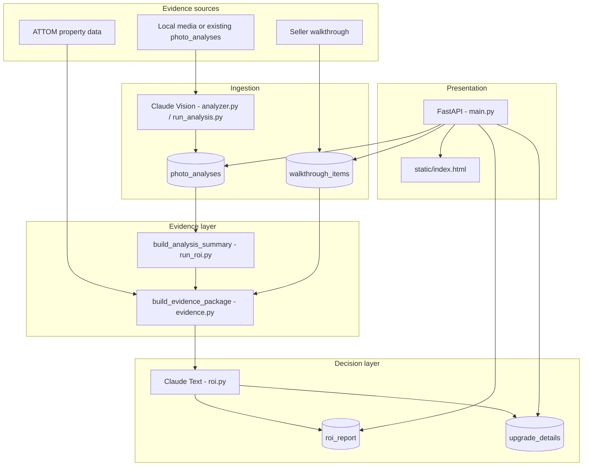

# ROI Analyzer Architecture

> Simpsonville Pre-Sale ROI Report — `simpsonville-analyzer`  
> Property: 130 Kingfisher Dr, Simpsonville SC 29680 (`130_kingfisher`)

## Overview

The ROI Analyzer helps a homeowner prepare a house for sale by combining existing photo analysis, a seller walkthrough checklist, property metadata, and Claude text generation into listing-readiness recommendations grounded in Greenville SC contractor costs and local comps.

External photo import has been removed. Existing `photo_analyses` records remain the photo evidence source in Supabase, and local media scripts remain available if new analysis is needed.

## System Diagram



## Runtime Components

| Component | Role |
|---|---|
| `main.py` | FastAPI server, report APIs, walkthrough APIs, inventory overrides, decision matrix APIs |
| `static/index.html` | Single-page UI for ROI, Decision Matrix, Walkthrough, Property Data, Inventory, Notes, and Print |
| `analyzer.py` | Claude vision analysis for local media workflows |
| `claude_client.py` | Active Claude API wrapper for vision, reports, and deep details |
| `attom.py` | Legacy cached ATTOM property facts and sales history |
| `run_analysis.py` | Local media photo-analysis CLI |
| `run_inventory.py` | Local media inventory-analysis CLI |
| `run_roi.py` | CLI report generation and analysis aggregation |
| `decision_matrix.py` | Decision Matrix persistence, evidence matching, and row/option loading |
| `report_composer.py` | Projects matrix selections into ROI report line items with traceability |

## Data Stores

| Table | Key | Purpose |
|---|---|---|
| `photo_analyses` | `id` | Per-photo Claude vision JSON; existing records remain usable |
| `roi_report` | `id` | Cached ROI report JSON |
| `upgrade_details` | `id` + `item_type` | Deep how-to detail cache |
| `walkthrough_items` | `uuid` | Per-property editable checklist rows |
| `decision_matrices` | `uuid` | Decision Matrix header/version/evidence snapshot |
| `decision_matrix_rows` | `uuid` | Matrix evidence rows and existing labels |
| `decision_matrix_options` | `uuid` | Matrix action options and costs |
| `decision_matrix_scenarios` | `uuid` | Matrix scenario selections |
| `inventory_overrides` | property id | Room count overrides |

## API Surface

```text
GET  /                          -> static/index.html
POST /analyze                   -> removed import endpoint; returns 410
POST /analyze/bulk              -> removed import endpoint; returns 410
GET  /analyze/results           -> cached photo analysis results
POST /report                    -> generate ROI report
POST /report/from-tier          -> generate matrix-tier ROI report
GET  /report, /report/status    -> cached reports and staleness
POST /report/regenerate-all     -> rebuild all scenarios
GET  /walkthrough-items         -> list checklist rows
PATCH /walkthrough-items/{id}   -> update checklist rows
GET  /decision-matrix/*         -> matrix views, tiers, scenarios, and health
PATCH /decision-matrix/rows/*   -> seller matrix edits
GET  /inventory                 -> inventory aggregation
POST /inventory/override        -> save inventory overrides
```

## CLI Tools

```bash
python run_analysis.py
python run_inventory.py
python run_roi.py
```

## External Services

| Service | Use |
|---|---|
| Anthropic Claude | Vision, report, and deep detail |
| Supabase | PostgreSQL persistence |
| ATTOM | Property facts, AVM, sales history; currently cached, live refresh planned via `ATTOM_API_KEY` |
| Railway | Hosting |

## Invariants

- Decision Matrix labels and evidence remain the condition source of truth.
- Existing `photo_analyses` records are not deleted or regenerated by report workflows.
- External photo import credentials are not required.
- Local media scripts are the only supported path for new photo/inventory analysis.
