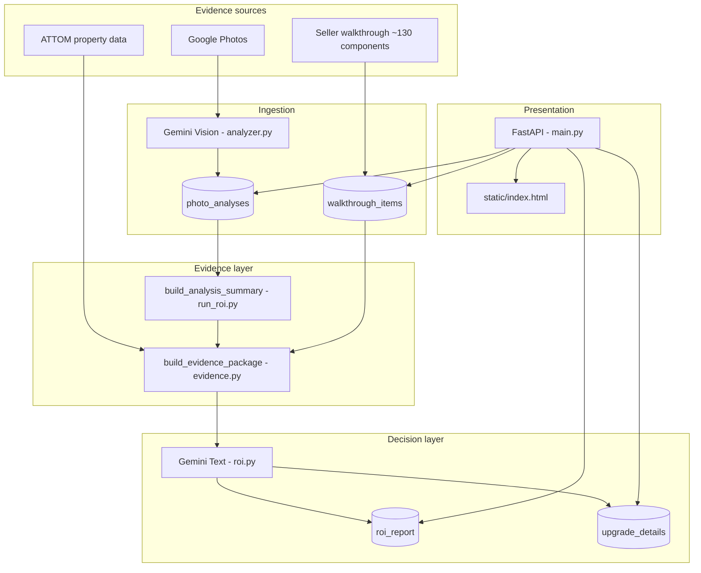

# ROI Analyzer Architecture

> Simpsonville Pre-Sale ROI Report — `simpsonville-analyzer`  
> Property: 130 Kingfisher Dr, Simpsonville SC 29680 (`130_kingfisher`)

## Overview

The ROI Analyzer helps a homeowner prepare a house for sale by combining photo analysis, a seller walkthrough checklist, property metadata, and Gemini text generation into budget-driven renovation recommendations grounded in Greenville SC contractor costs and local comps.

**Product split:**

| Layer | Surface | Question |
|-------|---------|----------|
| Evidence | Walkthrough tab | What's true about my house? |
| Decision | ROI tab | I have $X — what should I spend it on? |

---

## System diagram



---

## Runtime components

### FastAPI backend (`main.py`)

Primary web server. Serves `static/index.html`, exposes REST API, orchestrates report generation.

**Key responsibilities:**

- Google OAuth for Photos API (`photos.py`)
- Photo analysis endpoints (`analyzer.py`, `gemini_client.py`)
- ROI report CRUD and cache invalidation (`roi.py`)
- Walkthrough CRUD, seed, recalculate (`walkthrough.py`)
- Evidence package assembly for prompts (`evidence.py`)
- Inventory overrides (`run_inventory.py`)
- CSV export, deep-detail caching

**Deploy:** `uvicorn main:app` (Railway via `Procfile`)

### Static SPA (`static/index.html`)

Single-page app with no build step. Tabs include Photos, Analysis, Walkthrough, ROI scenarios, Inventory, Print.

- Debounced PATCH auto-save for walkthrough and inventory
- Budget scenario tabs: Spend Nothing, $5k, $15k, Maximize
- Async print with deep-detail prefetch

### ROI engine (`roi.py`)

Uses Gemini text model (`claude_client.py` / `gemini_client.py`) to produce JSON reports.

**Detail levels (budget scenarios):**

| Key | Label | Intent |
|-----|-------|--------|
| `spend_nothing` | Spend Nothing | Transaction-risk only, ~$0–$2k |
| `budget_5k` | $5,000 Budget | Highest ROI within ~$5k |
| `budget_15k` | $15,000 Budget | Balanced prep plan |
| `maximize` | Maximize Sale Price | No budget cap |

Legacy cache keys (`executive`, `standard`, `deep_dive`) map to the above via `LEGACY_LEVEL_MAP`.

**Buyer profiles:** `general`, `first_time_buyer`, `young_family`, `downsizer`, `investor`, `relocating_professional`

**Grounding inputs:**

- `_GREENVILLE_COST_ANCHORS` — 60+ local installed cost ranges
- `_KNOWN_REPAIR_FACTS` — photo-confirmed deal killers
- Unified evidence prompt from `evidence.format_evidence_prompt()`
- `prompt_version` SHA1 hash for cache staleness detection

### Photo analysis (`analyzer.py`, `run_analysis.py`)

Gemini Vision (`gemini-2.5-flash` default) analyzes each photo:

- Room type, condition, issues, upgrades, inspection flags, deal risk, dated features
- Results stored in Supabase `photo_analyses` (keyed by filename)

`run_roi.py` → `build_analysis_summary()` aggregates 130+ analyses into weighted issue/upgrade lists for evidence merging.

### Walkthrough (`walkthrough.py`)

Read-only master template (~130 components) + property-specific `OWNER_NOTE_SEEDS`.

**Two layers:**

| Layer | Name | Examples |
|-------|------|----------|
| `room` | Room-by-Room Seller Assessment | Kitchen countertops, primary bath vanity |
| `systems` | Hidden Issues & Transaction Risk | Roof, HVAC, GFCI, water heater |

**Template fields (locked):** zone, component, category, buyer_visibility, inspection_risk

**Seller-editable fields:** `owner_note`, `looks_fine`, `include_in_report`

**Backend-inferred (not shown by default):** condition_label, action, cost, priority, bucket — via rule-based inference + `calculate_walkthrough_fields()`

**Assessment prompts:** computed at enrich time (`get_assessment_prompt()`), shown as placeholders only — never persisted.

### Evidence package (`evidence.py`)

Merges walkthrough rows + photo summary + property facts into a unified structure for ROI prompts.

**Precedence on conflict:** walkthrough > photos > metadata

**Confidence tiers:**

| Tier | Definition |
|------|------------|
| `confirmed` | Walkthrough + photos agree |
| `observed` | One direct source |
| `inferred` | Metadata/context only |
| `unknown` | No evidence |

`looks_fine=true` rows appear as seller-dismissed; `include_in_report` controls ROI routing independently.

### Supporting modules

| Module | Role |
|--------|------|
| `photos.py` | Google Photos OAuth, album listing, thumbnail proxy |
| `attom.py` | Property AVM and sales history (cached JSON) |
| `gemini_client.py` | Vision API wrapper |
| `claude_client.py` | Text generation wrapper |
| `check_report.py` | Report validation utility |
| `run_inventory.py` | Materials shopping list generation |
| `app.py` | Separate Streamlit media review tool (local CSV annotations) |

---

## Data stores (Supabase)

| Table | Key | Purpose |
|-------|-----|---------|
| `photo_analyses` | `id` (filename) | Per-photo Gemini Vision JSON |
| `roi_report` | `id` (`{level}_{profile}`) | Cached ROI report JSON |
| `upgrade_details` | `id` + `item_type` | Deep how-to detail cache |
| `oauth_tokens` | `id` (`google`) | Google OAuth token |
| `walkthrough_items` | `uuid` | Per-property editable checklist rows |
| `inventory_overrides` | property id | Room count overrides |

**Walkthrough uniqueness:** `(property_id, zone, component, layer)`

**Migrations:** `migrations/walkthrough_items.sql` (+ v2, v3, v4 incremental columns)

---

## API surface (selected)

```
GET  /                          → static/index.html
GET  /auth/*                    → Google OAuth
GET  /photos/*                  → Albums, thumbnails
POST /analyze, /analyze/bulk    → Vision analysis
POST /report                    → Generate ROI report
GET  /report, /report/status    → Cached reports + staleness
POST /report/regenerate-all     → Rebuild all scenarios
GET  /walkthrough-items         → List checklist rows
POST /walkthrough-items/seed    → Idempotent template seed
PATCH /walkthrough-items/{id}   → Seller edits
POST /walkthrough-items/recalculate → Backfill inferred fields
GET  /inventory                 → Materials list
```

---

## CLI tools

```bash
python run_analysis.py    # Batch photo vision analysis → Supabase
python run_roi.py         # Generate reports from CLI
python run_inventory.py   # Inventory generation
```

---

## External services

| Service | Use |
|---------|-----|
| Google Gemini | Vision + report + deep detail |
| Supabase | PostgreSQL persistence |
| Google Photos | Source images (OAuth, read-only) |
| ATTOM | Property facts (cached) |
| Railway | Hosting |

---

## Key design constraints

1. **Walkthrough = evidence backbone** — 100% component coverage; photos supplement gaps.
2. **Seller sees facts only** on Walkthrough tab; recommendations live on ROI tab.
3. **Rule-based inference in Phase 1** — Gemini does not infer walkthrough condition from notes (deferred Phase 3).
4. **Cost anchors are ground truth** — `_KNOWN_REPAIR_FACTS` and Greenville anchors override ambiguous AI interpretation.
5. **No application framework** — vanilla HTML/CSS/JS SPA; changes are direct file edits.

---

## Related docs

- [ux-decisions.md](ux-decisions.md) — walkthrough UX choices
- [rejected-designs.md](rejected-designs.md) — approaches we did not ship
- [open-questions.md](open-questions.md) — unresolved decisions
